2025년 9월 17일 I 기업분석\_Earnings Preview

BUY (유지)
========

| 목표주가(12M) | 95,000원(상향) |
| --- | --- |
| 현재주가(9.16) | 79,400원 |

Key Data

| KOSPI 지수 (pt) | 3,449.62 |
| 52주 최고/최저(원) | 79,400/49,900 |
| 시가총액(십억원) | 470,019.3 |
| 시가총액비중(%) | 16.56 |
| 발행주식수(천주) | 5,919,637.9 |
| 60일 평균 거래량(천주) | 17,932.7 |
| 60일 평균 거래대금(십억원) | 1,216.2 |
| 외국인지분율(%) | 50.78 |
| 주요주주 지분율(%) |  |
| 삼성생명보험 외 15 인 | 20.15 |
| 국민연금공단 | 7.75 |

Consensus Data

2025 2026

| 매출액(십억원) | 315,827.4 | 333,903.5 |
| 영업이익(십억원) | 29,016.2 | 39,909.5 |
| 순이익(십억원) | 30,325.0 | 37,343.7 |
| EPS(원) | 4,373 | 5,448 |
| BPS(원) | 62,103 | 66,586 |

Stock Price

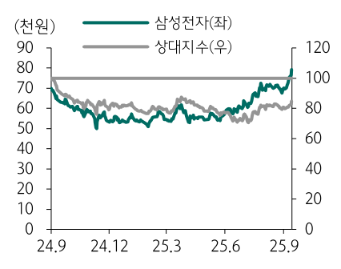

Chart Type: bar

|  | 24.9 | 24.12 | 25.3 | 25.6 | 25.9 |
| --- | --- | --- | --- | --- | --- |
| 삼성전자() | 70.5천원 | 104.7천원 | 104.7천원 | 72.5천원 | 76.5천원 |
| 상대지수(우) | 66천원 | 63.5천원 | 64천원 | 67천원 | 73천원 |

Financial Data

(십억원, %, 배, 원)

| 투자지표 | 2023 | 2024 | 2025F | 2026F |
| --- | --- | --- | --- | --- |
| 매출액 | 258,935.5 | 300,870.9 | 317,097.7 | 340,301.0 |
| 영업이익 | 6,567.0 | 32,726.0 | 31,362.2 | 46,600.3 |
| 세전이익 | 11,006.3 | 37,529.7 | 37,313.6 | 51,664.0 |
| 순이익 | 14,473.4 | 33,621.4 | 29,820.3 | 40,353.7 |
| EPS | 2,131 | 4,950 | 4,422 | 5,991 |
| 증감율 | (73.55) | 132.29 | (10.67) | 35.48 |
| PER | 36.84 | 10.75 | 17.96 | 13.25 |
| PBR | 1.51 | 0.92 | 1.30 | 1.21 |
| EV/EBITDA | 9.96 | 3.60 | 5.19 | 3.99 |
| ROE | 4.14 | 9.03 | 7.44 | 9.48 |
| BPS | 52,002 | 57,930 | 61,183 | 65,738 |
| DPS | 1,444 | 1,446 | 1,450 | 1,450 |

Analyst 김록호 roko.kim@hanafn.comRA 김영규 kyg1019@hanafn.com

삼성전자 (005930)
=============

메모리 호황으로 호실적
============

3Q25 Preview: 컨센서스 상회하는 영업이익 전망

삼성전자의 25년 3분기 매출액은 82.5조원(YoY +4%, QoQ +11%), 영업이익은 9.9조원(YoY +8%, QoQ +110%)으로 전망한다. 기존대비 실적을 상향하는 이유는 우호적인 환율과 예상보다 양호한 메모리 업황 및 폴더블 시리즈의 판매량 때문이다. AI 서버를 필두로 서버 중심의 견조한 수요로 인해 HBM, 서버용 DDR5, eSSD 출하가 양호했다. 그로 인해DRAM, NAND 모두 당초 가정했던 것보다 출하량과 가격이 상회한 것으로 추정된다.DRAM 가격은 6% 상승, 물량은 8% 증가, NAND 가격은 5%, 물량은 9% 증가할 것으로전망한다. 아울러 파운드리 부문은 가동률 상승으로 인해 적자폭을 1.4조원으로 축소시킬것으로 기대된다. 갤럭시 Z 시리즈의 판매량 역시 기존 전망치를 상회하며, Blended ASP에기여할 것으로 판단된다.

서버 중심의 견조한 수요 반영해 실적 상향 조정

일반 서버 중심으로 수요가 강한 것으로 파악된다. 추론용 AI 시장의 본격화, 다변화 등으로인해 기존 서버 내에서 고용량 DRAM 및 eSSD 수요가 증가하는 정황들이 포착되었다. 글로벌 메모리 업체들의 주가 역시 근 1개월 사이에 급상승하는 모양새다. 2018년, 2020년에클라우드 기반의 서버/데이터센터 투자가 활발했었고, 해당 서버/데이터센터에 탑재되었던DRAM 및 eSSD 교체 수요 발생 가능성도 농후하다. 지난 2년간 AI 서버에 집중되었던 투자가 일반 서버로 확대되고 있을 가능성을 배제할 수 없다. 일반 DRAM 가격의 상승폭 확대와 향후 일반 서버의 수요 증가를 감안해서, 2025년 및 2026년 삼성전자의 메모리 부문 영업이익을 상향 조정한다. 삼성전자 DS 사업부의 영업이익은 2025년 11.9조원, 2026년 26.8조원으로 전망한다.

실적 상향 여력 및 모멘텀에도 불구하고 여전히 저평가
=============================

삼성전자에 대한 투자의견 ‘BUY’를 유지하고, 목표주가를 기존 84,000원에서 95,000원으로상향한다. 목표주가 상향은 2025년 및 2026년 영업이익을 기존대비 각각 12%, 22% 상향하고, EBITDA를 12개월 선행에서 2026년 추정치로 변경했기 때문이다. 메모리 업황은 공급이 잘 제한되어 있기 때문에 2026년에도 타이트한 수급 밸런스가 유지될 것으로 전망된다.앞서 언급했던 것처럼 일반 서버의 수요 증가가 본격화된다면, 추가적인 가격 상승도 가능한 상황이다. 일반 DRAM 내에서의 높은 점유율과 해당 부문 실적 노출을 감안하면 삼성전자의 수혜 강도가 가장 클 것으로 판단된다. 아울러 HBM 주요 고객사향 공급 가능성까지고려하면 추가 업사이드도 상존한다. 그럼에도 불구하고 현재 주가는 PBR 1.2배로 역사적평균 1.4배를 하회중이고, 메모리 호황을 고려하면 PBR 상단과 평균의 중간값인 1.7배도 부담스러운 수준은 아니라고 판단한다.

삼성전자 (005930)
도표 1. 삼성전자 분기 및 연간 실적 추정(수정 후)

(단위: 조원)

|  | 1Q25 | 2Q25 | 3Q25F | 4Q25F | 1Q26F | 2Q26F | 3Q26F | 4Q26F | 2024 | 2025F | 2026F |
| --- | --- | --- | --- | --- | --- | --- | --- | --- | --- | --- | --- |
| 매출액 | 79.1 | 74.6 | 82.5 | 80.8 | 82.2 | 80.1 | 89.7 | 88.4 | 300.9 | 317.1 | 340.3 |
| YoY | 10% | 1% | 4% | 7% | 4% | 7% | 9% | 9% | 16% | 5% | 7% |
| QoQ | . 4% 4 | -6% | 11% | -2% | 1 7% . | -3% | 12% | -1% |  |  |  |
| 매출 원가 | 51.0 | 49.0 | 52.0 | 51.4 | 53.0 | 50.8 | 55.2 | 54.7 | 190.4 | 203.4 | 213.6 |
| % Sales | 64% | 66% | 63% | 64% | 65% | 63% | 61% | 62% | 63% | 64% | 63% |
| 판관비 | 21.4 | 20.8 | 20.6 | 19.4 | 19.7 | 19.0 | 21.0 | 20.4 | 77.8 | 82.3 | 80.1 |
| % Sales | 27% | 28% | 25% | 24% | 24% | 24% | 23% | 23% | 26% | 26% | 24% |
| 감가상각비 | 11.0 | 10.1 | 11.2 | 11.3 | 11.4 | 11.6 | 11.9 | 12.1 | 41.7 | 43.6 | 45.8 |
| % Sales | 14% | 14% | 14% | 14% | 14% | 14% | 13% | 14% | 14% | 14% | 13% |
| 영업이익 | 6.7 | 4.7 | 9.9 | 10.0 | 9.4 | 10.3 | 13.5 | 13.3 | 32.7 | 31.4 | 46.6 |
| 영업이익률 | 8% | 6% | 12% | 12% | 11% | 13% | 15% | 15% | 11% | 10% | 14% |
| YoY | 1% | -55% | 8% | 54% | 41% | 117% | 36% | 33% | 400% | -4% | 49% |
| QoQ | 3% | -29% | 110% | 1% | -6% | 9% | 32% | -2% |  |  |  |
| EBITDA | 17.7 | 14.9 | 21.2 | 21.3 | 20.9 | 21.9 | 25.5 | 25.5 | 74.5 | 75.0 | 92.4 |
| % Sales YoY | 22% | 20% | 26% | 26% | 25% | 27% | 28% | 29% | 25% | 24% | 27% |
|  | 7% | -28% | 5% | 24% | 18% | 47% | 20% | 20% | 70% | 1% | 25% |
| QoQ | 3% | -16% | 42% | 1% | -2% | 5% | 17% | 0% |  |  |  |
| 세전이익 | 9.2 | 5.8 | 11.2 | 11.2 | 10.8 | 11.5 | 14.8 | 14.6 | 37.5 | 37.4 | 51.7 |
| 세전이익률 | 12% | 8% | 14% | 14% | 13% | 14% | 16% | 16% | 12% | 12% | 15% |
| 법인세 | 1.0 | 0.7 | 2.6 | 2.6 | 2.2 | 2.3 | 3.0 | 2.9 | 3.0 | 6.8 | 10.3 |
| 법인세율 | 11% | 12% | 23% | 23% | 20% | 20% | 20% | 20% | 8% | 18% | 20% |
| 순이익 | 8.2 | 5.1 | 8.6 | 8.7 | 8.6 | 9.2 | 11.8 | 11.7 | 34.5 | 30.5 | 41.3 |
| 순이익률 | 10% | 7% | 10% | 11% | 11% | 11% | 13% | 13% | 11% | 10% | 12% |

자료: 삼성전자, 하나증권

도표 2. 삼성전자 분기 및 연간 실적 추정(수정 전)

(단위: 조원)

|  | 1Q25 | 2Q25P | 3Q25F | 4Q25F | 1Q26F | 2Q26F | 3Q26F | 4Q26F | 2024 | 2025F | 2026F |
| --- | --- | --- | --- | --- | --- | --- | --- | --- | --- | --- | --- |
| 매출액 YoY | 79.1 | 74.6 | 79.7 | 76.6 | 76.8 | 75.4 | 84.4 | 82.4 | 300.9 | 310.0 | 318.9 |
| 10% | 1% | 1% | 1% | -3% | 1% | 6% | 7% | 16% | 3% | 3% |
| . 4% 4 | -6% | 7% | -4% | . 3% 0 | -2% | 12% | -2% |  |  |  |
| QoQ 매출 원가 % Sales | 51.0 | 49.0 | 51.4 | 50.0 | 50.7 | 49.1 | 53.2 | 52.5 | 190.4 | 201.4 | 205.5 |
| 64% | 66% | 64% | 65% | 66% | 65% | 63% | 64% | 63% | 65% | 64% |
| 판관비 % Sales | 21.4 | 20.8 | 19.9 | 18.4 | 18.4 | 17.9 | 19.7 | 19.0 | 77.8 | 80.6 | 75.1 |
| 27% | 28% | 25% | 24% | 24% | 24% | 23% | 23% | 26% | 26% | 24% |
| 감가상각비 % Sales | 11.0 | 10.1 | 11.2 | 11.3 | 11.4 | 11.6 | 11.9 | 12.1 | 41.7 | 43.6 | 45.8 |
| 14% | 14% | 14% | 15% | 15% | 15% | 14% | 15% | 14% | 14% | 14% |
| 영업이익 영업이익률 YoY | 6.7 | 4.7 | 8.4 | 8.3 | 7.6 | 8.4 | 11.4 | 10.8 | 32.7 | 28.1 | 38.3 |
| 8% | 6% | 11% | 11% | 10% | 11% | 14% | 13% | 11% | 9% | 12% |
| 1% | -55% | -9% | 27% | 14% | 78% | 36% | 31% | 400% | -14% | 36% |
| 3% | -29% | 77% | -2% | -7% | 10% | 36% | -5% |  |  |  |
| QoQ EBITDA % Sales YoY | 17.7 | 14.9 | 19.6 | 19.5 | 19.1 | 20.0 | 23.4 | 23.0 | 74.5 | 71.7 | 84.1 |
| 22% | 20% | 25% | 25% | 25% | 27% | 28% | 28% | 25% | 23% | 26% |
| 7% | -28% | -3% | 14% | 8% | 34% | 19% | 18% | 70% | -4% | 19% |
| 3% | -16% | 32% | 0% | -2% | 5% | 17% | -2% |  |  |  |
| QoQ 세전이익 세전이익률 | 9.2 | 5.8 | 9.6 | 9.5 | 9.0 | 9.6 | 12.7 | 12.1 | 37.5 | 34.1 | 43.4 |
| 12% | 8% | 12% | 12% | 12% | 13% | 15% | 15% | 12% | 11% | 14% |
| 법인세 법인세율 | 1.0 | 0.7 | 2.2 | 2.2 | 1.8 | 1.9 | 2.5 | 2.4 | 3.0 | 6.1 | 8.7 |
| 11% | 12% | 23% | 23% | 20% | 20% | 20% | 20% | 8% | 18% | 20% |
| 순이익 순이익률 | 8.2 | 5.1 | 7.4 | 7.3 | 7.2 | 7.7 | 10.1 | 9.7 | 34.5 | 28.0 | 34.7 |
| 10% | 7% | 9% | 10% | 9% | 10% | 12% | 12% | 11% | 9% | 11% |

자료: 삼성전자, 하나증권

하나증권•2
삼성전자 (005930)
도 표 3. 사업부문별 실적 전망(수정 후)

(단위: 조원)

|  |  | 1Q25 | 2Q25 | 3Q25F | 4Q25F | 1Q26F | 2Q26F | 3Q26F | 4Q26F | 2024 | 2025F | 2026F |
| --- | --- | --- | --- | --- | --- | --- | --- | --- | --- | --- | --- | --- |
| 반도체 | 매출액 | 25.1 | 27.9 | 31.0 | 33.7 | 29.8 | 32.9 | 36.9 | 38.9 | 111.1 | 117.8 | 138.6 |
| 영업이익 | 1.1 | 0.4 | 4.4 | 5.9 | 4.1 | 5.8 | 8.0 | 9.0 | 15.2 | 11.9 | 26.8 |
| 영업이익률 | 4% | 2% | 14% | 18% | 14% | 18% | 22% | 23% | 14% | 10% | 19% |
| Memory | 매출액 | 19.1 | 21.2 | 23.9 | 26.0 | 23.0 | 25.3 | 28.2 | 30.0 | 84.5 | 90.2 | 106.4 |
| 영업이익 | 3.4 | 2.5 | 5.6 | 6.8 | 5.3 | 6.7 | 8.6 | 9.6 | 18.7 | 18.3 | 30.2 |
| 영업이익률 | 18% | 12% | 23% | 26% | 23% | 27% | 31% | 32% | 22% | 20% | 28% |
| DRAM | 매출액 | 11.8 | 12.7 | 14.3 | 15.5 | 14.4 | 15.7 | 17.8 | 18.7 | 48.0 | 54.2 | 66.6 |
| 영업이익 | 3.6 | 3.0 | 5.4 | 6.5 | 5.5 | 6.6 | 8.3 | 8.9 | 14.6 | 18.6 | 29.3 |
| 영업이익률 | 31% | 24% | 38% | 42% | 38% | 42% | 47% | 47% | 30% | 34% | 44% |
|  | NAND 매출액 | 7.3 | 8.6 | 9.6 | 10.5 | 8.6 | 9.5 | 10.4 | 11.3 | 36.5 | 36.0 | 39.8 |
| 영업이익 | -0.2 | -0.5 | 0.2 | 0.2 | -0.2 | 0.1 | 0.3 | 0.7 | 4.2 | -0.3 | 0.9 |
| 영업이익률 | -3% | -6% | 2% | 2% | -2% | 1% | 3% | 6% | 11% | -1% | 2% |
| non-Memory | 매출액 | 6.0 | 6.7 | 7.2 | 7.7 | 6.8 | 7.6 | 8.7 | 9.0 | 26.6 | 27.5 | 32.2 |
| 영업이익 | -2.5 | -2.3 | -1.4 | -1.1 | -1.4 | -1.2 | -0.9 | -0.8 | -4.7 | -7.4 | -4.3 |
| 영업이익률 | -42% | -35% | -20% | -14% | -21% | -15% | -10% | -9% | -18% | -27% | -13% |
| 디스플레이 | 매출액 | 5.9 | 6.4 | 8.3 | 8.6 | 6.0 | 6.4 | 8.7 | 9.2 | 29.1 | 29.2 | 30.3 |
| 영업이익 | 0.5 | 0.5 | 1.3 | 1.0 | 0.6 | 0.6 | 1.2 | 1.1 | 3.8 | 3.3 | 3.6 |
| 영업이익률 | 9% | 8% | 15% | 12% | 10% | 9% | 14% | 12% | 13% | 11% | 12% |
| MX/NW | 매출액 | 37.0 | 29.2 | 31.7 | 26.6 | 35.2 | 29.3 | 32.5 | 28.6 | 117.2 | 124.5 | 125.6 |
| 영업이익 | 4.3 | 3.1 | 3.4 | 2.3 | 4.0 | 2.9 | 3.5 | 2.6 | 10.6 | 13.2 | 13.1 |
| 영업이익률 | 12% | 11% | 11% | 9% | 11% | 10% | 11% | 9% | 9% | 11% | 10% |
| VD/가전 | 매출액 | 14.5 | 14.1 | 13.5 | 13.7 | 13.3 | 13.6 | 13.3 | 13.3 | 56.4 | 55.8 | 53.6 |
| 영업이익 | 0.3 | 0.2 | 0.2 | 0.2 | 0.3 | 0.4 | 0.2 | 0.1 | 1.7 | 0.9 | 1.0 |
| 영업이익률 | 2% | 1% | 2% | 1% | 2% | 3% | 2% | 1% | 3% | 2% | 2% |
| Harman | 매출액 | 3.4 | 3.8 | 4.0 | 4.2 | 3.7 | 3.9 | 4.1 | 4.3 | 14.3 | 15.4 | 16.1 |
| 영업이익 | 0.3 | 0.5 | 0.5 | 0.5 | 0.3 | 0.5 | 0.6 | 0.5 | 1.3 | 1.8 | 1.9 |
| 영업이익률 | 9% | 13% | 13% | 11% | 9% | 13% | 14% | 11% | 9% | 11% | 12% |
| Total | 매출액 | 79.1 | 74.6 | 82.5 | 80.8 | 82.2 | 80.1 | 89.7 | 88.4 | 300.9 | 317.1 | 340.3 |
| 영업이익 | 6.7 | 4.7 | 9.9 | 10.0 | 9.4 | 10.3 | 13.5 | 13.3 | 32.7 | 31.4 | 46.6 |
| 영업이익률 | 8% | 6% | 12% | 12% | 11% | 13% | 15% | 15% | 11% | 10% | 14% |

자료: 삼성전자, 하나증권

도 표 4. 사업부문별 실적 전망(수정 전)

(단위: 조원)

|  |  | 1Q25 | 2Q25P | 3Q25F | 4Q25F | 1Q26F | 2Q26F | 3Q26F | 4Q26F | 2024 | 2025F | 2026F |
| --- | --- | --- | --- | --- | --- | --- | --- | --- | --- | --- | --- | --- |
| 반도체 | 매출액 | 25.1 | 27.9 | 29.1 | 30.4 | 26.8 | 29.6 | 33.0 | 34.2 | 111.1 | 112.5 | 123.5 |
| 영업이익 | 1.1 | 0.4 | 3.0 | 4.3 | 2.5 | 4.0 | 6.0 | 6.7 | 15.2 | 8.8 | 19.2 |
| 영업이익률 | 4% | 2% | 10% | 14% | 9% | 14% | 18% | 20% | 14% | 8% | 16% |
| Memory | 매출액 | 19.1 | 21.2 | 22.0 | 22.8 | 20.1 | 22.0 | 24.3 | 25.3 | 84.5 | 85.2 | 91.7 |
| 영업이익 | 3.4 | 2.5 | 4.7 | 5.5 | 3.8 | 5.1 | 6.7 | 7.3 | 18.7 | 16.1 | 22.9 |
| 영업이익률 | 18% | 12% | 21% | 24% | 19% | 23% | 28% | 29% | 22% | 19% | 25% |
| DRAM | 매출액 | 11.8 | 12.7 | 14.0 | 14.8 | 13.2 | 14.5 | 16.5 | 17.3 | 48.0 | 53.3 | 61.6 |
| 영업이익 | 3.6 | 3.0 | 4.8 | 5.6 | 4.3 | 5.2 | 6.6 | 7.1 | 14.6 | 17.1 | 23.3 |
| 영업이익률 | 31% | 24% | 34% | 38% | 33% | 36% | 40% | 41% | 30% | 32% | 38% |
| NAND | 매출액 | 7.3 | 8.6 | 8.1 | 8.0 | 6.8 | 7.5 | 7.8 | 7.9 | 36.5 | 31.9 | 30.1 |
| 영업이익 | -0.2 | -0.5 | -0.2 | -0.1 | -0.5 | -0.2 | 0.1 | 0.2 | 4.2 | -1.0 | -0.4 |
| 영업이익률 | -3% | -6% | -2% | -1% | -8% | -2% | 1% | 3% | 11% | -3% | -1% |
| non-Memory | 매출액 | 6.0 | 6.7 | 7.1 | 7.5 | 6.7 | 7.5 | 8.6 | 8.9 | 26.6 | 27.3 | 31.8 |
| 영업이익 | -2.5 | -2.3 | -1.9 | -1.5 | -1.5 | -1.3 | -0.9 | -0.9 | -4.7 | -8.2 | -4.6 |
| 영업이익률 | -42% | -35% | -26% | -20% | -23% | -17% | -11% | -10% | -18% | -30% | -14% |
| 디스플레이 | 매출액 | 5.9 | 6.4 | 8.3 | 8.6 | 6.0 | 6.4 | 8.7 | 9.2 | 29.1 | 29.2 | 30.3 |
| 영업이익 | 0.5 | 0.5 | 1.2 | 1.0 | 0.6 | 0.6 | 1.2 | 1.1 | 3.8 | 3.2 | 3.6 |
| 영업이익률 | 9% | 8% | 14% | 12% | 10% | 9% | 14% | 12% | 13% | 11% | 12% |
| MX/NW | 매출액 | 37.0 | 29.2 | 30.9 | 26.0 | 33.1 | 28.1 | 31.3 | 27.4 | 117.2 | 123.1 | 119.9 |
| 영업이익 | 4.3 | 3.1 | 3.4 | 2.3 | 3.7 | 2.8 | 3.4 | 2.5 | 10.6 | 13.0 | 12.4 |
| 영업이익률 | 12% | 11% | 11% | 9% | 11% | 10% | 11% | 9% | 9% | 11% | 10% |
| VD/가전 | 매출액 | 14.5 | 14.1 | 13.3 | 13.4 | 13.1 | 13.4 | 13.2 | 13.2 | 56.4 | 55.3 | 52.9 |
| 영업이익 | 0.3 | 0.2 | 0.3 | 0.2 | 0.3 | 0.4 | 0.3 | 0.1 | 1.7 | 1.0 | 1.1 |
| 영업이익률 | 2% | 1% | 2% | 1% | 2% | 3% | 2% | 0% | 3% | 2% | 2% |
| Harman | 매출액 | 3.4 | 3.8 | 4.0 | 4.2 | 3.7 | 3.9 | 4.1 | 4.3 | 14.3 | 15.4 | 16.1 |
| 영업이익 | 0.3 | 0.5 | 0.5 | 0.4 | 0.3 | 0.5 | 0.5 | 0.4 | 1.3 | 1.7 | 1.7 |
| 영업이익률 | 9% | 13% | 12% | 10% | 9% | 12% | 11% | 10% | 9% | 11% | 11% |
| Total | 매출액 | 79.1 | 74.6 | 79.7 | 76.6 | 76.8 | 75.4 | 84.4 | 82.4 | 300.9 | 310.0 | 318.9 |
| 영업이익 | 6.7 | 4.7 | 8.4 | 8.3 | 7.6 | 8.4 | 11.4 | 10.8 | 32.7 | 28.1 | 38.3 |
| 영업이익률 | 8% | 6% | 11% | 11% | 10% | 11% | 14% | 13% | 11% | 9% | 12% |

자료: 삼성전자, 하나증권

하나증권•3
삼성전자 (005930)
도 표 5. 주요 가정(수정 후)

|  | | 1Q25 | 2Q25 | 3Q25F | 4Q25F | 1Q26F | 2Q26F | 3Q26F | 4Q26F | 2024 | 2025F | 2026F |
| --- | --- | --- | --- | --- | --- | --- | --- | --- | --- | --- | --- | --- |
| 반도체 | |  |  |  |  |  |  |  |  |  |  |  |
| DRAM | Shipment(1Gb Eq.) b t growth i ASP ($) QoQ / YoY | 22,849 1% 0.35 -20% | 25,421 11% 0.35 0% 46,080 27% | 27,543 8% 0.38 6% 50,348 9% | 28,936 5% 0.39 3% 53,787 7% | 27,041 -7% 0.39 0% 47,194 | 28,768 6% 0.40 3% 52,124 10% | 31,437 9% 0.42 4% 57,298 10% | 32,526 3% 0.43 2% 62,823 10% 0.13 0% | 97,986 15% 0.36 61% 173,520 11% 0.15 | 104,749 7% 0.37 3% 186,635 8% 0.14 | 119,772 14% 0.41 11% 219,439 18% 0.13 -2% |
| NAND Shipment(16Gb Eq.) b t growth i ASP ($) QoQ / YoY | | 36,420 -10% 0.14 -14% | 0.13 -4% | 0.14 5% | 0.14 2% | -12% 0.13 -5% | 0.13 0% | 0% |  | 62% | -10% 474 |  |
| 디스플레이 Mobile Shipment(Mn) QoQ / YoY ASP ($) QoQ / YoY | | 88 -40% 53.38 15% | 101 15% 53.58 | 140 38% | 144 3% | 89 -38% 55.09 0% | 102 15% 54.45 -1% | 0.13 148 45% 54.15 | 152 3% 53.85 | 494 3% 51.70 | -4% 54.16 5% | 492 4% 54.38 0% |
| MX/NW | |  | 0% | 54.45 2% | 55.23 1% |  |  | -1% | -1% | -3% |  |  |
| Mobile Total Shipment(Mn) QoQ / YoY | | 69 15% | 65 -6% |  |  | 69 10% | 66 -4% | 68 4% | 67 -2% | 257 0% | 264 3% 232 4% 98% | 270 2% 239 3% 99% 297.7 1% |
|  | |  |  | 67 3% | 63 -7% |  |  |  |  |  |  |  |
| Smart Phone Shipment(Mn) QoQ / YoY Portion/Total | |  |  |  | 55 -8% 98% | 61 11% 99% | 58 |  |  | 224 |  |  |
| ASP ($) QoQ / YoY | | 61 17% 98% | 57 -6% 98% 278.2 -18% | 60 4% 99% 298.1 7% | 259.2 -13% | 340.1 31% | -5% 99% 282.3 -17% | 61 5% 99% 302.3 7% | 59 -2% 99% 266.1 -12% | 0% 98% 294.2 1% | 293.4 0% |  |
| VD | | 337.9 30% |  |  | 555.4 -9% |  |  | 8.96 7% 577.5 -8% |  |  | 577.8 |  |
| LCD TV Shipment(Mn) QoQ / YoY ASP ($) QoQ / YoY | | 9.19 -14% 584.6 11% | 8.46 -8% 590.5 9% | 8.81 4% 584.6 -7% | 10.20 16% | 8.71 -15% 577.6 12% | 8.38 -4% 583.3 8% |  | 10.39 16% 548.6 -10% | 38 0% 602.0 -3% | 37 -3% -4% | 36 -1% 570.6 -1% |

자료: 삼성전자, 하나증권

도 표 6. 주요 가정(수정 전)

|  | | 1Q25 | 2Q25P | 3Q25F | 4Q25F | 1Q26F | 2Q26F | 3Q26F | 4Q26F | 2024 | 2025F | 2026F |
| --- | --- | --- | --- | --- | --- | --- | --- | --- | --- | --- | --- | --- |
| 반도체 | |  |  |  |  |  |  |  |  |  |  |  |
| DRAM | Shipment(1Gb Eq.) | 22,849 | 25,421 | 28,278 | 29,317 | 26,257 | 28,369 | 31,023 | 32,098 | 97,986 | 105,864 | 117,747 |
| b t growth i | 1% | 11% | 11% | 4% | -10% | 8% | 9% | 3% | 15% | 8% | 11% |
| ASP ($) | 0.35 | 0.35 | 0.37 | 0.38 | 0.38 | 0.38 | 0.40 | 0.41 | 0.36 | 0.36 | 0.39 |
| QoQ / YoY | -20% | 0% | 3% | 3% | 0% | 2% | 4% | 2% | 61% | 2% | 8% |
| NAND | Shipment(16Gb Eq.) | 36,420 | 46,080 | 44,968 | 44,766 | 40,552 | 44,635 | 45,978 | 46,757 | 173,520 | 172,234 | 177,923 |
| b t growth i | -10% | 27% | -2% | 0% | -9% | 10% | 3% | 2% | 11% | -1% | 3% |
| ASP ($) | 0.14 | 0.13 | 0.13 | 0.13 | 0.13 | 0.13 | 0.13 | 0.13 | 0.15 | 0.13 | 0.13 |
| QoQ / YoY | -14% | -4% | 0% | 0% | -5% | 0% | 2% | 0% | 62% | -13% | -5% |
| 디스플레이 | |  |  |  |  |  |  |  |  |  |  |  |
| Mobile | Shipment(Mn) | 88 | 101 | 140 | 144 | 89 | 102 | 148 | 152 | 494 | 474 | 492 |
| QoQ / YoY | -40% | 15% | 38% | 3% | -38% | 15% | 45% | 3% | 3% | -4% | 4% |
| ASP ($) | 53.38 | 53.58 | 54.45 | 55.23 | 55.09 | 54.45 | 54.15 | 53.85 | 51.70 | 54.16 | 54.38 |
| QoQ / YoY | 15% | 0% | 2% | 1% | 0% | -1% | -1% | -1% | -3% | 5% | 0% |
| MX/NW | |  |  |  |  |  |  |  |  |  |  |  |
| Mobile Total Shipment(Mn) QoQ / YoY | | 69 | 65 | 67 | 62 | 68 | 65 | 68 | 66 | 257 | 264 | 266 |
| 15% | -6% | 3% | -7% | 9% | -4% | 4% | -2% | 0% | 3% | 1% |
| Smart Phone Shipment(Mn) QoQ / YoY Portion/Total ASP ($) | | 61 | 57 | 59 | 54 | 60 | 57 | 60 | 58 | 224 | 232 | 235 |
| 17% | -6% | 3% | -8% | 10% | -5% | 5% | -2% | 0% | 3% | 1% |
| 98% | 98% | 98% | 98% | 99% | 99% | 99% | 99% | 98% | 98% | 99% |
| 337.9 | 278.2 | 295.3 | 259.7 | 325.1 | 276.3 | 295.9 | 257.5 | 294.2 | 292.8 | 288.7 |
| 30% | -18% | 6% | -12% | 25% | -15% | 7% | -13% | 1% | 0% | -1% |
| QoQ / YoY VD | |  |  |  |  |  |  |  |  |  |  |  |
| LCD TV Shipment(Mn) | | 9.19 | 8.46 | 8.81 | 10.20 | 8.71 | 8.38 | 8.96 | 10.39 | 38 | 37 | 36 |
| QoQ / YoY | | -14% | -8% | 4% | 16% | -15% | -4% | 7% | 16% | 0% | -3% | -1% |
| ASP ($) | | 584.6 | 590.5 | 584.6 | 555.4 | 577.6 | 583.3 | 577.5 | 548.6 | 602.0 | 577.8 | 570.6 |
| QoQ / YoY | | 11% | 9% | -7% | -9% | 12% | 8% | -8% | -10% | -3% | -4% | -1% |

자료: 삼성전자, 하나증권

하나증권•4
삼성전자 (005930)
도 표 7. 밸류에이션

| 영업가치(십억원) | 사업부 | EBITDA | Target EV/EBITDA | Value | 비고1 | 비고2 |
| --- | --- | --- | --- | --- | --- | --- |
|  | 메모리 | 55,255 | 5.4 | 298,376 | Peer Group 평균 EV/EBITDA 적용 | SK하이닉스, Micron, Nanya |
|  | 비메모리 | 8,521 | 8.8 | 74,982 | Peer Group 평균 EV/EBITDA 적용 | TSMC, Global Foundry |
|  | SDC | 3,615 | 3.7 | 13,375 | Peer Group 평균 EV/EBITDA 적용 | LG디스플레이, BOE, AUO 등 |
|  | DX | 14,620 | 4.0 | 58,478 | Peer Group 평균 EV/EBITDA 적용 | Apple, Xiaomi, LG전자, Whirlpool 등 |
|  | Harman | 1,884 | 6.0 | 11,304 | Peer Group 평균 EV/EBITDA 적용 |  |
|  | Sub-Total (A) | 83,894 | 5.6 | 456,514 |  |  |
| 비영업가치(십억원) | 구분 | 시가총액/장부가 | 지분율 | Value |  |  |
|  | 상장주식 | 136,409 |  | 35,511 |  |  |
|  | 비상장 주식 | 349 |  | 349 |  |  |
|  | Sub-Total (B) | 273,515 |  | 25,102 | 장부가 및 시가 대비 30% 할인 |  |
| 순현금(십억원) | 구분 | Value |  | Value |  |  |
|  | 현금 등 | 100,728 |  | 100,728 |  |  |
|  | 차입금 | 14,030 |  | 14,030 |  |  |
|  | Sub-Total (C) | 86,699 |  | 86,699 |  |  |
| 주주가치(십억원) |  | (A)+(B)+© |  | 502,324 |  |  |
| 주식수 |  |  |  | 주식수 |  |  |
| 주식수 | 발행주식수 |  |  | 6,792,669 |  |  |
| 주식수(천주) | 유통주식수 |  |  | 5,969,783 |  |  |
| 적정주당가치 |  |  |  | 95,198 |  |  |
| 목표주가(원) |  |  |  | 95,000 |  |  |

자료: 하나증권

도표 8. DDR4 가격 추이

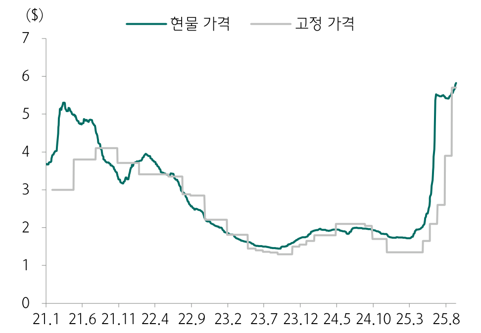

Chart Type: bar

|  | 21.1 | 21.6 | 21.11 | 22.4 | 22.9 | 23.2 | 23.7 | 23.12 | 24.5 | 24.10 | 25.3 | 25.8 |
| --- | --- | --- | --- | --- | --- | --- | --- | --- | --- | --- | --- | --- |
| TERR | 5.2 | 4.9 | 3.8 | 3.3 | 2.8 | 2.5 | 2.3 | 2.2 | 2.1 | 2.0 | 3.2 | 5.4 |
| 고정 가격 | 3.9 | 3.6 | 2.8 | 2.2 | 2.0 | 1.9 | 1.8 | 1.7 | 1.8 | 1.9 | 2 | 2.1 |

자료: DRAMExchange, 하나증권

도표 9. DDR5 가격 추이

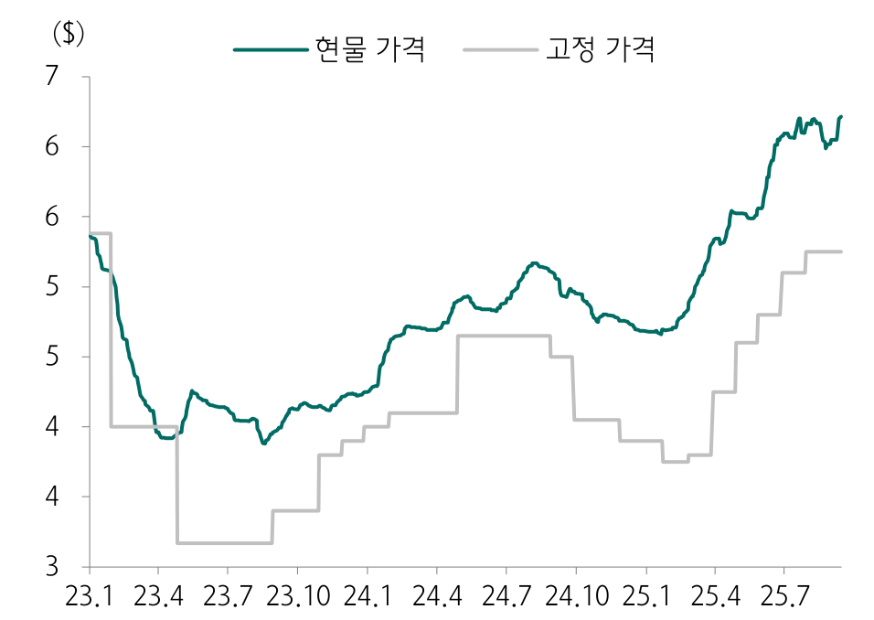

Chart Type: bar

|  | 23.1 | 23.4 | 23.7 | 23.10 | 24. | 24.4 | 24.7 | 24.10 | 25. | 25.4 | 25.7 |
| --- | --- | --- | --- | --- | --- | --- | --- | --- | --- | --- | --- |
| TERR | 5.5 | 3.8 | 3.9 | 3.8 | 4.4 | 4.1 | 4.4 | 4.2 | 4.4 | 4.6 | 5.7 |
| 고정 가격 | 5.5 | 4.7 | 4.2 | 3.9 | 4.3 | 4.6 | 4.7 | 4.8 | 4.9 | 5.3 | 6.2 |

자료: DRAMExchange, 하나증권

도표 10. MLC 128Gb 가격 추이

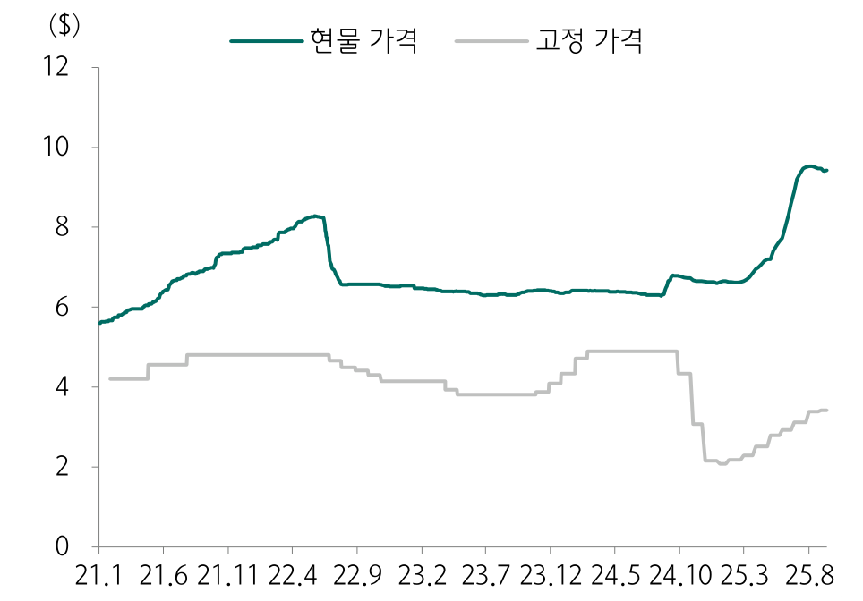
도표 11. SLC 8Gb 가격 추이

자료: DRAMExchange, 하나증권

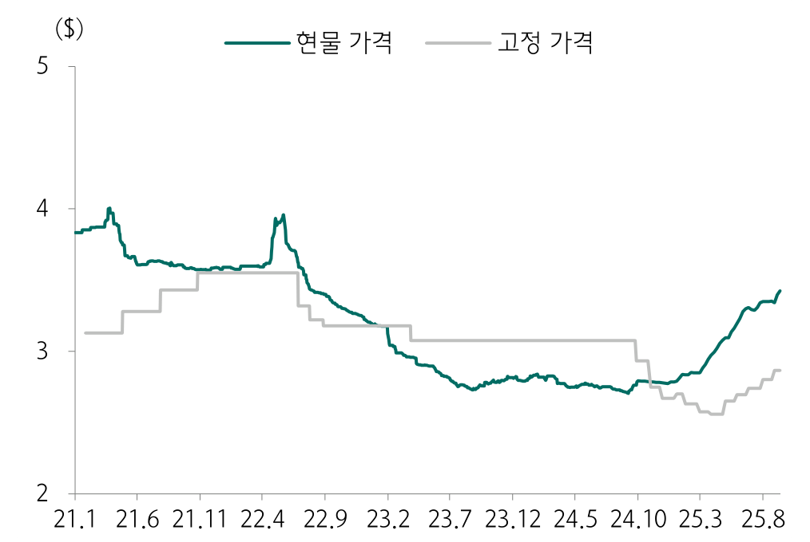

자료: DRAMExchange, 하나증권

하나증권•5
삼성전자 (005930)
도표 12. 주요 DRAM 업체들의 연초 이후 주가 추이

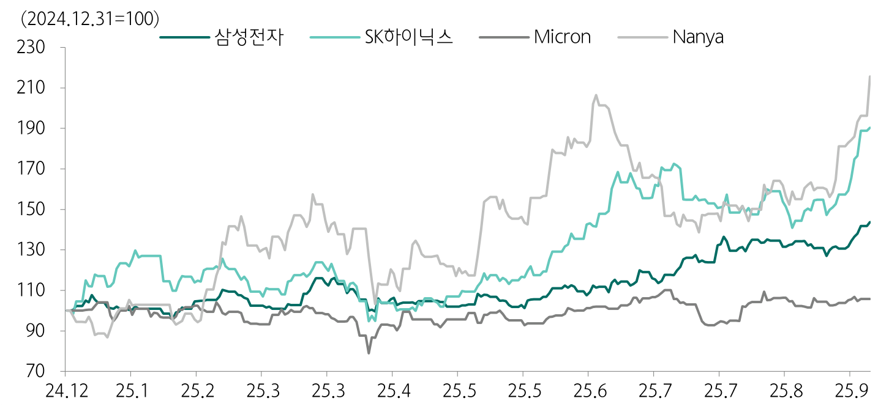

자료: Quantiwise, 하나증권

도표 13. 주요 NAND 업체들의 연초 이후 주가 추이

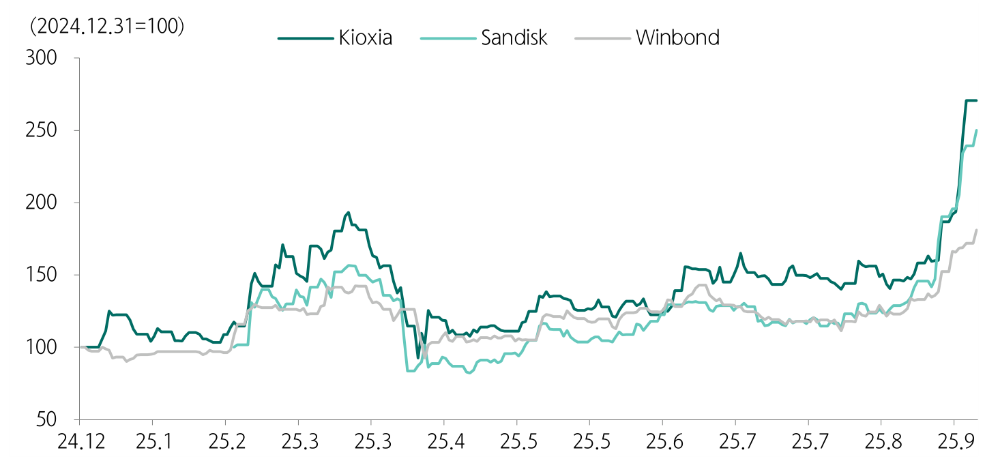

Chart Type: line

|  | Kioxia | Sandisk | Winbond |
| --- | --- | --- | --- |
| item\_01 | 100Degrees (°) | 100Degrees (°) | 150Degrees (°) |

자료: Quantiwise, 하나증권

도표 14. 한국 수출액 전년대비 증감률 vs 삼성전자 시가총액

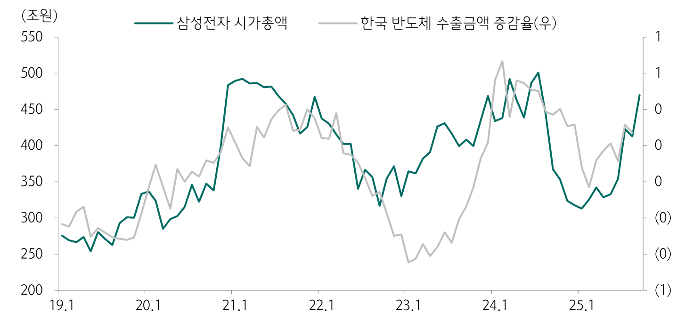

Chart Type: bar

|  | 19. | 20. | 21.1 | 22.1 | 23.1 | 24. | 25. |
| --- | --- | --- | --- | --- | --- | --- | --- |
| 삼성전자 사가총액 | 270.9조원 | 314.8조원 | 457.4조원 | 410.9조원 | 421.0조원 | 446.8조원 | 309.3조원 |
| 한국 반도체 수출금액 증감을(%) | 300.6조원 | 328.3조원 | 400.8조원 | 439.8조원 | 410.9조원 | 445.4조원 | 328.9조원 |

자료: Quantiwise, KITA 하나증권

하나증권•6

삼성전자 (005930)

도표 15. 삼성전자 스마트폰 지역별 비중
도표 16. 갤럭시 S 시리즈 출시 후 12개월 판매량 추이

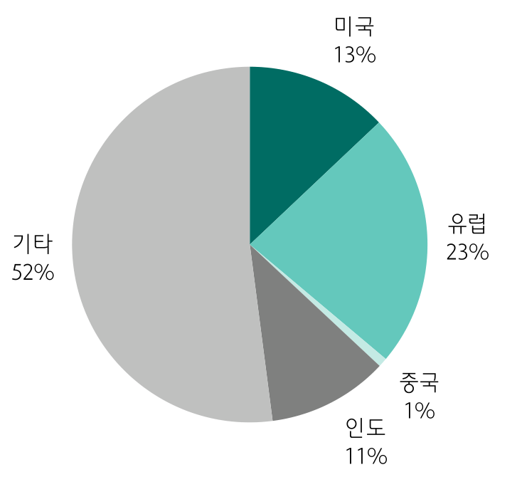

Chart Type: pie

|  | 기타 | 유럽 | 기도 | 중국 | 미국 |
| --- | --- | --- | --- | --- | --- |
| item\_01 | 52% | 23% | 11% | 1% | 13% |

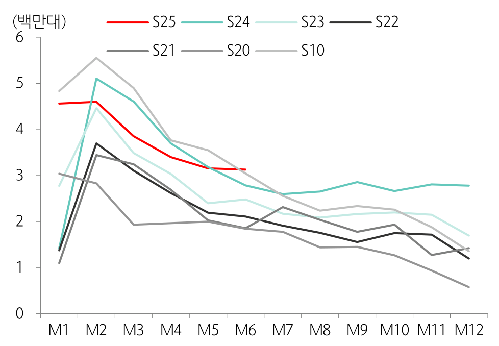

자료: Counterpoint, 하나증권주: 2024년 판매량 기준

자료: Counterpoint, 하나증권

도표 17. PBR 밴드

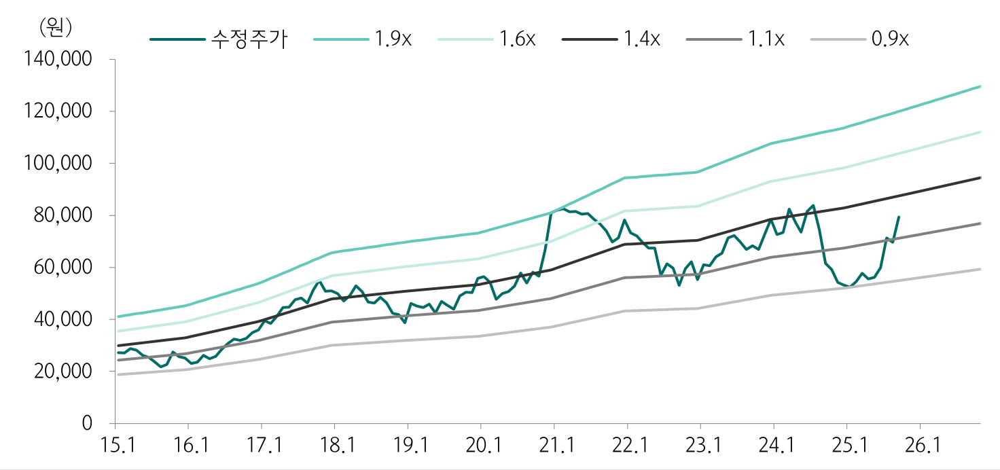

자료: Wisefn, 하나증권

하나증권•7
삼성전자 (005930)

추정 재무제표
=======

손익계산서
=====

|  | 2023 | 2024 | 2025F | 2026F | 2027F |
| --- | --- | --- | --- | --- | --- |
| 매출액 | 258,935.5 | 300,870.9 | 317,097.7 | 340,301.0 | 356,176.7 |
| 매출원가 | 180,388.6 | 186,562.3 | 203,446.0 | 213,602.4 | 225,991.3 |
| 매출총이익 | 78,546.9 | 114,308.6 | 113,651.7 | 126,698.6 | 130,185.4 |
| 판관비 | 71,979.9 | 81,582.7 | 82,289.5 | 80,098.4 | 82,901.8 |
| 영업이익 | 6,567.0 | 32,726.0 | 31,362.2 | 46,600.3 | 47,283.6 |
| 금융손익 | 3,454.6 | 3,717.6 | 4,491.2 | 4,600.3 | 5,308.1 |
| 종속/관계기업손익 | 887.6 | 751.0 | 595.3 | 463.5 | (244.3) |
| 기타영업외손익 | 97.1 | 335.1 | 864.9 | 0.0 | 0.0 |
| 세전이익 | 11,006.3 | 37,529.7 | 37,313.6 | 51,664.0 | 52,347.3 |
| 법인세 | (4,480.8) | 3,078.4 | 6,771.0 | 10,332.8 | 10,469.5 |
| 계속사업이익 | 15,487.1 | 34,451.4 | 30,542.6 | 41,331.2 | 41,877.8 |
| 중단사업이익 | 0.0 | 0.0 | 0.0 | 0.0 | 0.0 |
| 당기순이익 | 15,487.1 | 34,451.4 | 30,542.6 | 41,331.2 | 41,877.8 |
| 비지배주주지분 순이익 | 1,013.7 | 830.0 | 722.3 | 977.5 | 990.4 |
| 지배주주순이익 | 14,473.4 | 33,621.4 | 29,820.3 | 40,353.7 | 40,887.4 |
| 지배주주지분포괄이익 | 17,845.7 | 50,048.2 | 31,339.7 | 40,789.8 | 41,329.3 |
| NOPAT | 9,240.5 | 30,041.6 | 25,671.2 | 37,280.2 | 37,826.9 |
| EBITDA | 45,233.5 | 75,356.8 | 75,524.4 | 93,700.7 | 95,350.1 |
| 성장성(%) |  |  |  |  |  |
| 매출액증가율 | (14.33) | 16.20 | 5.39 | 7.32 | 4.67 |
| NOPAT증가율 | (82.22) | 225.11 | (14.55) | 45.22 | 1.47 |
| EBITDA증가율 | (45.16) | 66.60 | 0.22 | 24.07 | 1.76 |
| 영업이익증가율 | (84.86) | 398.34 | (4.17) | 48.59 | 1.47 |
| (지배주주)순익증가율 | (73.55) | 132.30 | (11.31) | 35.32 | 1.32 |
| EPS증가율 | (73.55) | 132.29 | (10.67) | 35.48 | 1.32 |
| 수익성(%) |  |  |  |  |  |
| 매출총이익률 | 30.33 | 37.99 | 35.84 | 37.23 | 36.55 |
| EBITDA이익률 | 17.47 | 25.05 | 23.82 | 27.53 | 26.77 |
| 영업이익률 | 2.54 | 10.88 | 9.89 | 13.69 | 13.28 |
| 계속사업이익률 | 5.98 | 11.45 | 9.63 | 12.15 | 11.76 |

(단위:십억원)

|  | 2023 | 2024 | 2025F | 2026F | 2027F |
| --- | --- | --- | --- | --- | --- |
| 주당지표(원) |  |  |  |  |  |
| EPS | 2,131 | 4,950 | 4,422 | 5,991 | 6,070 |
| BPS | 52,002 | 57,930 | 61,183 | 65,738 | 70,373 |
| CFPS | 7,656 | 11,394 | 11,563 | 13,980 | 14,120 |
| EBITDAPS | 6,659 | 11,094 | 11,200 | 13,911 | 14,156 |
| SPS | 38,120 | 44,293 | 47,023 | 50,523 | 52,880 |
| DPS | 1,444 | 1,446 | 1,450 | 1,450 | 1,450 |
| 주가지표(배) |  |  |  |  |  |
| PER | 36.84 | 10.75 | 17.96 | 13.25 | 13.08 |
| PBR | 1.51 | 0.92 | 1.30 | 1.21 | 1.13 |
| PCFR | 10.25 | 4.67 | 6.87 | 5.68 | 5.62 |
| EV/EBITDA | 9.96 | 3.60 | 5.19 | 3.99 | 3.79 |
| PSR | 2.06 | 1.20 | 1.69 | 1.57 | 1.50 |
| 재무비율(%) |  |  |  |  |  |
| ROE | 4.14 | 9.03 | 7.44 | 9.48 | 8.95 |
| ROA | 3.20 | 6.93 | 5.69 | 7.29 | 6.91 |
| ROIC | 3.96 | 11.64 | 9.38 | 13.03 | 12.60 |
| 부채비율 | 25.36 | 27.93 | 26.56 | 26.66 | 25.46 |
| 순부채비율 | (21.92) | (23.20) | (22.97) | (25.60) | (26.62) |
| 이자보상배율(배) | 7.06 | 36.20 | 55.76 | 90.46 | 101.02 |

투자지표
====

대차대조표

(단위:십억원)

|  | 2023 | 2024 | 2025F | 2026F | 2027F |
| --- | --- | --- | --- | --- | --- |
| 유동자산 | 195,936.6 | 227,062.3 | 230,003.4 | 260,667.9 | 278,045.3 |
| 금융자산 | 92,407.2 | 112,651.8 | 107,988.3 | 127,217.9 | 138,369.6 |
| 현금성자산 | 69,080.9 | 53,705.6 | 45,134.0 | 58,475.7 | 66,421.9 |
| 매출채권 | 36,647.4 | 43,623.1 | 46,522.6 | 50,882.6 | 53,256.3 |
| 재고자산 | 51,625.9 | 51,754.9 | 55,194.9 | 60,367.6 | 63,183.9 |
| 기타유동자산 | 15,256.1 | 19,032.5 | 20,297.6 | 22,199.8 | 23,235.5 |
| 비유동자산 | 259,969.4 | 287,469.7 | 303,650.8 | 313,508.9 | 331,127.6 |
| 투자자산 | 20,680.1 | 24,348.8 | 24,947.7 | 26,206.3 | 26,891.5 |
| 금융자산 | 8,912.7 | 11,756.7 | 11,518.6 | 11,518.6 | 11,518.6 |
| 유형자산 | 187,256.3 | 205,945.2 | 218,752.2 | 230,576.2 | 250,800.4 |
| 무형자산 | 22,741.9 | 23,738.6 | 24,460.3 | 21,235.8 | 17,945.2 |
| 기타비유동자산 | 29,291.1 | 33,437.1 | 35,490.6 | 35,490.6 | 35,490.5 |
| 자산총계 | 455,906.0 | 514,531.9 | 533,654.1 | 574,176.8 | 609,172.9 |
| 유동부채 | 75,719.5 | 93,326.3 | 92,150.1 | 99,506.8 | 101,476.1 |
| 금융부채 | 8,423.5 | 15,379.8 | 7,369.9 | 7,369.9 | 5,333.9 |
| 매입채무 | 11,319.8 | 12,370.2 | 13,192.4 | 14,428.7 | 15,101.9 |
| 기타유동부채 | 55,976.2 | 65,576.3 | 71,587.8 | 77,708.2 | 81,040.3 |
| 비유동부채 | 16,508.7 | 19,013.6 | 19,838.5 | 21,344.0 | 22,163.7 |
| 금융부채 | 4,262.5 | 3,950.4 | 3,774.1 | 3,774.1 | 3,774.1 |
| 기타비유동부채 | 12,246.2 | 15,063.2 | 16,064.4 | 17,569.9 | 18,389.6 |
| 부채총계 | 92,228.1 | 112,339.9 | 111,988.6 | 120,850.8 | 123,639.8 |
| 지배주주지분 | 353,233.8 | 391,687.6 | 410,384.5 | 441,067.5 | 472,284.2 |
| 자본금 | 897.5 | 897.5 | 897.5 | 897.5 | 897.5 |
| 자본잉여금 | 4,403.9 | 4,403.9 | 4,403.9 | 4,403.9 | 4,403.9 |
| 자본조정 | 99.0 | (1,724.9) | (1,363.1) | (1,363.1) | (1,363.1) |
| 기타포괄이익누계액 | 1,181.1 | 17,597.9 | 18,860.6 | 18,860.6 | 18,860.6 |
| 이익잉여금 | 346,652.2 | 370,513.2 | 387,585.6 | 418,268.6 | 449,485.3 |
| 비지배주주지분 | 10,444.1 | 10,504.5 | 11,281.0 | 12,258.5 | 13,248.9 |
| 자본총계 | 363,677.9 | 402,192.1 | 421,665.5 | 453,326.0 | 485,533.1 |
| 순금융부채 | (79,721.3) | (93,321.6) | (96,844.4) | (116,074.0 ) | (129,261.7 ) |

현금흐름표

(단위:십억원)

|  | 2023 | 2024 | 2025F | 2026F | 2027F |
| --- | --- | --- | --- | --- | --- |
| 영업활동 현금흐름 | 44,137.4 | 72,982.6 | 72,267.0 | 88,982.5 | 90,244.3 |
| 당기순이익 | 15,487.1 | 34,451.4 | 30,542.6 | 41,331.2 | 41,877.8 |
| 조정 | 34,109.0 | 40,098.8 | 44,641.2 | 47,100.4 | 48,066.6 |
| 감가상각비 | 38,666.6 | 42,630.8 | 44,162.2 | 47,100.4 | 48,066.5 |
| 외환거래손익 | 0.0 | 0.0 | 0.0 | 0.0 | 0.0 |
| 지분법손익 | (887.6) | (751.0) | (118.9) | 0.0 | 0.0 |
| 기타 | (3,670.0) | (1,781.0) | 597.9 | 0.0 | 0.1 |
| 영업활동 자산부채 변동 | (5,458.7) | (1,567.6) | (2,916.8) | 550.9 | 299.9 |
| 투자활동 현금흐름 | (16,922.8) | (85,381.7) | (59,916.1) | (62,846.3) | (68,890.8) |
| 투자자산감소(증가) | 3,903.8 | (2,917.6) | (480.1) | (1,258.5) | (685.2) |
| 자본증가(감소) | (57,513.0) | (51,250.2) | (53,871.6) | (55,700.0) | (65,000.0) |
| 기타 | 36,686.4 | (31,213.9) | (5,564.4) | (5,887.8) | (3,205.6) |
| 재무활동 현금흐름 | (8,593.1) | (7,797.2) | (18,610.2) | (9,670.7) | (11,706.7) |
| 금융부채증가(감소) | 2,352.7 | 6,644.2 | (8,186.2) | 0.0 | (2,036.0) |
| 자본증가(감소) | 0.0 | 0.0 | 0.0 | 0.0 | 0.0 |
| 기타재무활동 | (1,081.3) | (3,552.7) | (701.3) | 0.0 | 0.0 |
| 배당지급 | (9,864.5) | (10,888.7) | (9,722.7) | (9,670.7) | (9,670.7) |
| 현금의 증감 | 19,400.2 | (15,375.3) | (3,466.6) | 13,341.8 | 7,946.1 |
| Unlevered CFO | 52,006.6 | 77,398.4 | 77,977.3 | 94,164.1 | 95,105.7 |
| Free Cash Flow | (13,473.9) | 21,576.3 | 18,364.1 | 33,282.5 | 25,244.3 |

자료: 하나증권

하나증권•8
삼성전자 (005930)

투자의견 변동 내역 및 목표주가 괴리율

삼성전자

Compliance Notice

 당사는 2025년 9월 17일 현재 해당회사의 지분을 1%이상 보유 하고 있지 않습니다 본 자료를 작성한 애널리스트(김록호)는 자료의 작성과 관련하여 외부의 압력이나 부당한 간섭을 받지 않았으며, 본인의 의견을 정확하게 반영하여 신의성실 하게 작성하였습니다. 본 자료는 기관투자가 등 제 3자에게 사전 제공한 사실이 없습니다 본자료를 작성한 애널리스트(김록호)는 2025년 9월 17일 현재 해당회사의 유가증권을보유하고 있지 않습니다

본 조사자료는 고객의 투자에 정보를 제공할 목적으로 작성되었으며, 어떠한 경우에도무단 복제 및 배포 될 수 없습니다. 또한 본 자료에 수록된 내용은 당사가 신뢰할 만한자료 및 정보로 얻어진 것이나, 그 정확성이나 완전성을 보장할 수 없으므로 투자자 자신의 판단과 책임하에 최종결정을 하시기 바랍니다. 따라서 어떠한 경우에도 본 자료는고객의 주식투자의 결과에 대한 법적 책임소재의 증빙자료로 사용될 수 없습니다.

|  |  |  |  |  |
| --- | --- | --- | --- | --- |
| 날짜 | 투자의견 | 목표주가 | 괴리율 | |
| 평균 | 최고/최저 |
| 25.9.17 | BUY | 95,000 |  |  |
| 25.8.1 | BUY | 84,000 | -15.30% | -5.48% |
| 25.7.4 | BUY | 80,000 | -17.84% | -9.25% |
| 25.1.6 | BUY | 84,000 | -32.75% | -24.05% |
| 24.9.24 | BUY | 95,000 | -40.33% | -31.89% |
| 24.7.8 | BUY | 117,000 | -34.38% | -24.96% |
| 24.4.15 | BUY | 106,000 | -25.83% | -17.83% |
| 24.1.4 | BUY | 100,000 | -24.23% | -14.70% |
| 23.7.28 | BUY | 95,000 | -25.99% | -16.21% |
| 22.9.27 | BUY | 78,000 | -18.73% | -5.90% |

투자등급 관련사항 및 투자의견 비율공시

 투자의견의 유효기간은 추천일 이후 12개월을 기준으로 적용

 기업의 분류

BUY(매수)\_목표주가가 현주가 대비 15% 이상 상승 여력Neutral(중립)\_목표주가가 현주가 대비 -15%~15% 등락Reduce(비중축소)\_목표주가가 현주가 대비 15% 이상 하락 가능

 산업의 분류

Overweight(비중확대)\_업종지수가 현재지수 대비 15% 이상 상승 여력Neutral(중립)\_업종지수가 현재지수 대비 -15%~15% 등락Underweight(비중축소)\_업종지수가 현재지수 대비 -15%~15% 등락

| 투자등급 | BUY(매수) | Neutral(중립) | Reduce(매도) | 합계 |
| --- | --- | --- | --- | --- |
| 금융투자상품의 비율 | 95.87% | 4.13% | 0.00% | 100% |

\* 기준일: 2025년 09월 14일

하나증권•9