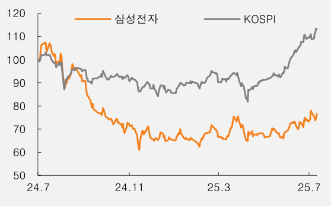
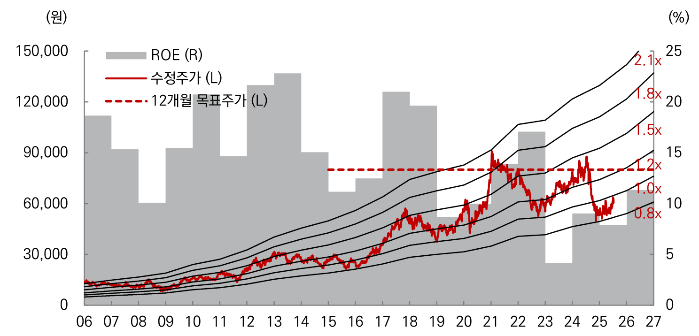

Equity Research2025.7.14

| 투자의견(유지) | | | 매수 |
| --- | --- | --- | --- |
| 목표주가(하향) | | | ▼ 78,000원 |
| 현재주가(25/7/11) | | | 62,600원 |
| 상승여력 | | | 24.6% |
| 영 업이익(25F,십억원) | | | 29,336 |
| Consensus 영업이익(25F,십억원) | | | 28,514 |
| EPS 성장률(25F,%) | | | -5.1 |
| MKT EPS 성장률(25F,%) | | | 24.6 |
| P/E(25F,x) | | | 13.3 |
| MKT P/E(25F,x) | | | 11.6 |
| KOSPI | | | 3,175.77 |
| 시가총액(십억원) | | | 370,569 |
| 발행주식수(백만주) | | | 5,920 |
| 유동주식비율(%) | | | 75.9 |
| 외국인 보유비중(%) | | | 49.8 |
| 베타(12M) 일간수익률 | | | 1.15 |
| 52주 최저가(원) | | | 49,900 |
| 52주 최고가(원) | | | 87,700 |
| (%) | 1M | 6M | 12M |
| 절대주가 | 4.5 | 13.2 | -28.5 |
| 상대주가 | -4.3 | -10.3 | -34.9 |

Chart Type: bar

|  | 24.7 | 24.11 | 25.3 | 25.7 |
| --- | --- | --- | --- | --- |
| 삼성전자 | 100 | 90 | 70 | 60 |
| KOSPI | 100 | 90 | 70 | 70 |

| [반도체] |
| 김영건 |
| younggun.kim.a@miraeasset.com |
| 김제호 |
| jaeho.kim.b@miraeasset.com |

005930 · 반도체

삼성전자
====

실망감도 이미 반영된 주가
==============

투자의견 및 밸류에이션

동사에 대한 12개월 목표주가를 78,000원(기존 80,000원)으로 하향한다. 주가/순자산 목표 배수를 1.2배(기존 1.3배)로 낮췄다. P/B 1.3배라는 눈높이가 과하게 높은 것은 아니지만, 메모리 업계 가장 고부가 자산인 HBM에 대한 불용처리 상각은단순히 규모의 차원을 넘어 이를 생산한 설비 자산, 기술력과 영업권등 무형자산이온전히 작동해 지렛대 효과를 발휘하고 있다고 보기 어렵다는 반증이라는 판단이다.

동사의 북미 최대 GPU 제조사향 HBM 3E 12단 납품이 3Q25 이후로 미뤄졌다. 업계 모두가 생산 가능했던 원가 경쟁 위주의 범용 제품 시장에서 특정 제조사만 가능한 경쟁 구도가 되다보니 선두 업체는 보수적 투자 기조를 통해 불확실성을 줄이고수익성을 극대화하는 여유를 누리고 있다.

시장조사기관 IDC에 따르면 26년 HBM 시장 Bit growth는 30%대로 시장 컨센서스(40%대)에 비해 낮으며, 그마저도 HBM4의 Bit 비중은 24%로 높다. HBM3E의제품 수명이 길지 않다는 의미다. 동사는 이제 투자자들에게 현실성 있고 예측 가능한 현실적 로드맵과 가이던스를 공식 IR 채널을 통해 제시할 필요가 있어보인다.

비록 아쉬운 결과에도 불구하고 ‘매수’의 의견을 유지하는 이유는 여전히 스마트폰과 플렉서블 디스플레이, 범용 메모리 시장에서의 시장 지배력의 지위를 고수하고는있기에 P/B 배수의 1배 이하로의 할인은 무리라는 판단이며, 공시를 통해 밝힌 3.9조원 규모의 자사주 매입에 따른 수급적 효과와 향후 소각 등을 통한 주주환원을 기대하기 때문이다.

글로벌 가속기 산업에서의 구매 주체들은 N사-T사-H사로 이어지는 역사상 유례를찾기 어려운 단일 공급망 체제에 의존하고 있다. 이에 대한 유일한 대안은 동사의경쟁력 회복이다. 동사는 최근 6개 분기동안 R&D 투입 비중을 높이며 기술력 확보에 사활을 걸고 있는 것으로 보인다. 당사는 동사의 26년/27년 HBM 점유율을26%/35%로 추정하고 있다.

동사의 2Q25 잠정실적은 매출액 74.1조원(QoQ -6.4%), OP 4.6조원(QoQ -31.8%)을 기록했다. 부문별 OP는 DX 3.3조원, DS 0.4조원, SDC 0.4조원, 하만0.4조원으로 추정한다(확정은 7/31 발표). 전반적으로 예상 수준의 매출액을 기록한반면, DS 부문 이익이 기존 추정치(2.3조원)에 크게 미치지 못한 것으로 판단한다.

| 결산기 (12월) | 2023 | 2024 | 2025F | 2026F | 2027F |
| 매출액 (십억원) | 258,935 | 300,871 | 314,063 | 340,381 | 373,241 |
| 영업이익 (십억원) | 6,567 | 32,726 | 29,336 | 49,090 | 67,866 |
| 영업이익률 (%) | 2.5 | 10.9 | 9.3 | 14.4 | 18.2 |
| 순이익 (십억원) | 14,473 | 33,621 | 31,692 | 49,189 | 67,218 |
| EPS (원) | 2,131 | 4,950 | 4,700 | 7,303 | 9,980 |
| ROE (%) | 4.1 | 9.0 | 7.9 | 11.3 | 13.9 |
| P/E (배) | 36.8 | 10.7 | 13.3 | 8.6 | 6.3 |
| P/B (배) | 1.5 | 0.9 | 1.0 | 0.9 | 0.8 |
| 배당수익률 (%) | 1.8 | 2.7 | 2.3 | 2.3 | 2.3 |

주: K-IFRS 연결 기준, 순이익은 지배주주 귀속 순이익자료: 삼성전자, 미래에셋증권 리서치센터

삼성전자
2025.7.14
그림 1. 삼성전자 12개월 선행 P/B 밴드 차트

자료: LSEG, 미래에셋증권 리서치센터

표 1. 목표가 산출

| 구분 | 값 | Note |
| --- | --- | --- |
| 12MF BPS | 64,839 | 원 |
| Target P/B | 1.2 |  |
| 목표가 | 78,000 | 원 |
| 현재가 | 62,600 | 원 |
| 상승여력 | 24.6 | % |

자료: 미래에셋증권 리서치센터

표 2. SOTP 방식으로 목표가 산출 (단순참고)

| 구분 | 12MF EBITDA | 목표 EV/EBITDA | Implied EV | Valuation peer & Note |
| --- | --- | --- | --- | --- |
| 영업가치 | 79.0 | 5.8 | 458.6 | 조원 |
| DX | 17.8 | 11.1 | 198.0 |  |
| MX/NW | 15.3 | 12.0 | 184.1 | Xiaomi, Apple 평균 50% 할인 |
| VD/DA | 2.5 | 5.6 | 13.9 | LG전자, Whirlpool |
| DS | 54.1 | 4.4 | 236.1 |  |
| Memory | 46.8 | 4.1 | 193.4 | SKH, MU 평균 30% 할인 |
| Foundry/LSI | 7.2 | 5.9 | 42.7 | TSMC, GF, Intel 평균 30% 할인 |
| SDC | 5.1 | 2.9 | 15.1 | Innolux, BOE, AUO |
| Harman | 2.0 | 4.7 | 9.4 | 현대모비스, 만도 |
| 구분 | 시가총액 | 지분율 | 지분가치 |  |
| 지분가치 |  |  | 89.6 | 조원 |
| 상장 |  |  | 36.4 |  |
| 삼성바이오로직스 | 75.2 | 31.2 | 23.5 |  |
| 삼성전기 | 10.2 | 23.7 | 2.4 |  |
| 삼성SDI | 14.5 | 19.6 | 2.8 |  |
| 삼성SDS | 14.2 | 22.6 | 3.2 |  |
| 기타 |  |  | 4.4 |  |
| 비상장 |  |  | 53.3 |  |
| 순부채 |  |  | -94.0 | 조원 |
| 목표 시가총액 |  |  | 597 | 조원, 지분가치(상장사 시총+비상장) 50% 할인 |
| 주식수 |  |  | 6,793 | 백만주, 보통주+우선주 |
| 목표가 |  |  | 87,944 | 원 |
| 현재가 |  |  | 62,600 | 원 |
| 상승여력 |  |  | 39.0 | % |

자료: LSEG, 미래에셋증권 리서치센터

2 Mirae Asset Securities Research
삼성전자
2025.7.14
표 3. 삼성전자 전사 부문별 실적 추이 및 전망

| (원, 조원, %) | 1Q24 | 2Q24 | 3Q24 8.4 -3.3 | 4Q24 | 1Q25 | 2Q25F | 3Q25F | 4Q25F 19.3 | 2023 | 2024F | 2025F | 2026F |
| --- | --- | --- | --- | --- | --- | --- | --- | --- | --- | --- | --- | --- |
| USD-KRW | 1,329 | 1,371 | 1,357 | 1,396 | 1,453 | 1,402 | 1,365 | 1,360 | 1,306 | 1,363 | 1,395 | 1,360 |
| QoQ/YoY | 0.5 | 3.2 | -1.0 | 2.9 | 4.0 | -3.5 | -2.6 | -0.4 | 1.1 | 4.4 | 2.3 | -2.5 |
| 매출액 | 71.9 | 74.1 8.5 | 79.1 | 75.8 | 79.1 | 74.1 -14.3 | 79.5 | 81.3 | 258.9 | 300.9 | 314.1 | 340.4 |
| DX | 47.3 | 42.1 | 45.0 0.7 2.8 | 40.5 | 51.7 | 44.0 | 45.3 | 42.4 | 170.0 | 174.9 | 183.3 | 187.5 |
| DS | 23.1 | 28.6 | 29.3 | 30.1 | 25.1 | 27.3 | 30.0 | 33.2 | 66.6 | 111.1 | 115.7 | 137.1 |
| SDC | 5.4 | 7.6 | 8.0 | 8.1 | 5.9 | 6.6 | 7.7 | 7.9 | 31.0 | 29.1 | 28.0 | 29.0 |
| Harman | 3.2 | 3.6 | 3.5 | 3.9 | 3.4 | 4.2 | 3.4 | 4.1 | 14.4 | 14.2 | 15.0 | 16.2 |
| QoQ/YoY | 6.1 | 3.0 | 6.8 | -4.2 | 4.4 | -6.4 | 7.3 | 2.2 | -14.3 | 16.2 21.7 | 4.4 | 8.4 |
| DX | 19.6 | -11.0 | 6.9 | -10.0 | 27.7 | -14.9 | 2.9 | -6.4 | -6.8 | 2.9 | 4.9 | 2.3 |
| DS | 6.7 | 23.4 | 2.5 | 2.8 | -16.5 | 8.6 | 10.1 | 10.6 | -32.4 | 66.8 | 4.2 | 18.5 |
| SDC | -44.2 | 42.0 | 4.6 | 1.3 | -27.6 | 11.9 | 17.0 | 3.4 | -9.9 | -6.0 | -3.7 | 3.5 |
| Harman | -18.5 | 13.1 55.3 | -2.5 | 10.5 0.5 | -12.3 | 21.7 | -19.4 | 22.1 | 8.9 | -1.0 | 5.5 | 7.7 |
| 영업이익 | 6.6 | 10.4 | 9.2 | 6.5 10.9 | 6.7 | 4.6 | 7.9 | 10.2 | 6.6 | 32.7 | 29.3 | 49.1 |
| DX | 4.1 | 2.7 | 3.4 12.0 | 2.3 12.0 | 4.7 | 3.3 | 3.3 | 2.6 | 14.4 | 12.4 | 13.9 | 14.2 |
| DS | 1.9 | 6.5 | 3.9 | 2.9 | 1.1 | 0.4 | 3.6 | 6.2 | -14.9 | 15.1 | 11.3 | 30.6 |
| SDC | 0.3 -26.6 | 1.0 | 1.5 | 0.9 | 0.5 | 0.4 | 0.8 | 0.9 | 5.6 | 3.7 1.3 | 2.5 | 2.5 |
| Harman | 0.2 | 0.3 | 0.4 | 0.4 | 0.3 | 0.4 | 0.3 | 0.4 53.1 | 1.2 | 1.3 0.6 | 1.4 | 1.6 57.2 |
| QoQ/YoY | 133.9 | 58.1 | -12.1 | -29.3 | 3.0 | -31.8 | 74.0 | 28.2 13.9 | -84.9 -0.3 | 398.3 | -10.4 | 67.3 |
| DX | 55.6 | -33.2 | 23.9 0.5 2.3 | -32.7 17.8 | 108.0 | -30.8 | 0.6 12.7 11.2 | -21.6 | 12.9 -31.1 | -13.5 53.6 0.5 | 11.4 | 2.6 51.7 |
| DS DS | TTB 9.7 | 237.0 9.9 | -40.1 10.7 | -25.9 16.0 | -61.4 10.9 | -65.1 | 821.5 10.7 | 76.0 11.9 48.4 | TTR 46.3 | TTB | -25.2 44.8 | 170.7 |
| SDC SDC | -83.1 1.1 | 196.5 1.8 | 49.8 1.0 | -42.6 | -46.8 1.0 | -17.5 0.5 0.7 | 104.9 | 11.5 2.4 | -6.5 4.8 | -32.9 | -33.1 | -0.8 3.2 |
| Harman Others | -29.8 | 32.9 0.4 | 11.0 | 10.1 | -21.6 0.9 | 40.6 0.6 | -39.9 | 61.0 2.4 | 33.3 2.5 | 11.4 | 8.3 2.3 | 15.3 |
| 영업이익률 | 9.2 | 14.1 | 11.6 | 8.6 QoQ/YoY | 8.4 | 6.1 | 10.0 6.6 | 12.5 -0.0 | 2.5 1.0 | 10.9 | 9.3 | 14.4 -32.6 |
| DX 1.0 | 8.6 | 6.5 | 7.5 | 5.6 43.2 | 9.1 | 7.4 | 7.3 | 6.1 8.8 | 8.5 | 7.1 | 7.6 -5.7 | 7.6 13.0 |
| DS | 8.3 | 22.6 7.0 | 13.2 | 9.5 48.7 | 4.4 -31.4 | 1.4 -1.9 | 11.8 3.5 4.2 | 18.8 6.2 | -22.3 1.0 -4.3 | 13.6 | 9.8 | 22.3 15.5 |
| SDC | 6.3 -35.3 | 13.2 2.5 | 18.9 | 10.7 | 7.9 | 5.8 | 10.2 | 11.0 | 18.0 | 12.8 | 8.9 | 8.5 |
| Harman | 7.5 42.7 | 8.8 | 10.1 | 10.0 1.8 | 9.0 -48.8 | 10.4 36.3 | 7.7 50.0 | 10.2 32.4 | 8.2 -4.4 | 9.2 102.7 | 9.4 -26.9 | 10.1 -9.0 |
| EBITDA SDC | 16.6 | 20.6 | 20.2 -46.2 | 18.0 | 18.2 | 15.9 | 19.3 | 21.6 | 45.2 | 75.4 | 75.1 | 95.8 |
| DX Others | 5.1 | 3.8 -15.5 | 4.4 74.4 | 3.3 17.4 | 5.8 -36.2 | 4.4 -2.6 | 4.4 0.0 | 3.7 | 18.6 | 16.7 DS 7.5 | 18.2 -10.1 | 18.6 -0.3 |
| DS | 9.9 | 14.6 | 13.0 | 12.4 | 10.6 | 9.7 | 12.9 | 15.7 | 15.2 | 49.9 | 49.0 | 69.2 |
| SDC FCF | 1.0 5.2 | 1.7 | 2.2 | 1.5 | 1.1 6.2 | 1.0 4.0 | 1.4 6.6 | 1.5 -7.9 | 8.9 | 6.4 | 5.1 24.5 | 5.1 38.6 |
| Harman | 0.4 | 0.5 | 0.5 7.8 | 0.5 0.2 | 0.4 | 0.6 | 0.4 | 0.6 7.8 | 1.7 | 1.9 | 2.0 | 2.2 27.6 |
| QoQ/YoY | 30.8 | 24.2 | -1.6 | -11.1 | 1.2 | -12.6 | 21.5 12.4 | 11.9 | -45.2 | 66.6 -10.6 -30.1 | -0.4 9.6 | 2.1 |
| DX 50.6 | 38.5 77.1 | -26.3 47.5 | 17.3 | -24.5 | 73.7 | -24.6 | 0.4 | -16.2 | 9.9 -71.1 | 227.1 | -1.7 | 41.2 |
| DS | -63.5 | 66.2 | -11.4 30.6 | -4.6 -29.1 9.6 | -14.1 -26.8 -15.9 | -8.4 -8.4 28.2 | 33.0 38.6 | 21.3 6.5 39.5 | -18.8 19.6 | -28.1 9.1 | -19.7 6.3 | 0.1 |
 SDC Harman Capex | -19.5 11.3 | 22.1 4.5 12.1 |

Note: Capex는 C/F가 아닌 발표(자산인식) 기준, FCF = EBITDA – Capex,자료: 삼성전자, 미래에셋증권 리서치센터

Mirae Asset Securities Research 3
삼성전자
2025.7.14
표 4. 전사 부문별 실적 전망치 변경 내역

|  |  |  |  |  |  |  |  |  |  |  |  |  |
| --- | --- | --- | --- | --- | --- | --- | --- | --- | --- | --- | --- | --- |
| (원, 조원, %, %pt) | 2Q25F | | | 3Q25F | | | 2025F | | | 2026F | | |
| 신규 | 기존 | 변경율 | 신규 | 기존 | 변경율 | 신규 | 기존 | 변경율 | 신규 | 기존 | 변경율 |
| USD-KRW | 1,402 | 1,443 | -2.9 | 1,365 | 1,443 | -5.4 | 1,395 | 1,446 | -3.5 | 1,360 | 1,443 | -5.8 |
| 매출액 | 74.1 | 76.2 | -2.7 | 79.5 | 85.9 | -7.4 | 314.1 | 325.0 | -3.4 | 340.4 | 365.2 | -6.8 |
| DX | 44.0 | 44.7 | -1.5 | 45.3 | 49.1 | -7.8 | 183.3 | 188.8 | -2.9 | 187.5 | 195.6 | -4.2 |
| DS | 27.3 | 27.2 | 0.2 | 30.0 | 31.5 | -4.7 | 115.7 | 118.0 | -2.0 | 137.1 | 144.4 | -5.1 |
| SDC | 6.6 | 8.1 | -19.3 | 7.7 | 8.7 | -11.9 | 28.0 | 32.6 | -13.9 | 29.0 | 39.4 | -26.3 |
| Harman | 4.2 | 4.2 | 0.0 | 3.4 | 3.9 | -13.6 | 15.0 | 15.2 | -1.4 | 16.2 | 16.5 | -1.9 |
| 영업이익 | 4.6 | 6.4 | -29.0 | 7.9 | 10.0 | -21.0 | 29.3 | 33.0 | -11.2 | 49.1 | 52.7 | -6.8 |
| DX | 3.3 | 2.8 | 16.2 | 3.3 | 3.4 | -2.2 | 13.9 | 12.6 | 10.0 | 14.2 | 13.3 | 7.2 |
| DS | 0.4 | 2.3 | -83.2 | 3.6 | 5.2 | -32.0 | 11.3 | 15.5 | -27.1 | 30.6 | 31.8 | -4.0 |
| SDC | 0.4 | 0.9 | -57.1 | 0.8 | 1.1 | -28.2 | 2.5 | 3.6 | -29.8 | 2.5 | 5.9 | -58.3 |
| Harman | 0.4 | 0.4 | 2.3 | 0.3 | 0.4 | -28.5 | 1.4 | 1.4 | 1.8 | 1.6 | 1.7 | -1.7 |
| 영업이익률 | 6.1 | 8.4 | -2.3 | 10.0 | 11.7 | -1.7 | 9.3 | 10.2 | -0.8 | 14.4 | 14.4 | -0.0 |
| DX | 7.4 | 6.3 | 1.1 | 7.3 | 6.8 | 0.4 | 7.6 | 6.7 | 0.9 | 7.6 | 6.8 | 0.8 |
| DS | 1.4 | 8.4 | -7.0 | 11.8 | 16.6 | -4.7 | 9.8 | 13.1 | -3.4 | 22.3 | 22.1 | 0.2 |
| SDC | 5.8 | 10.9 | -5.1 | 10.2 | 12.5 | -2.3 | 8.9 | 10.9 | -2.0 | 8.5 | 15.1 | -6.5 |
| Harman | 10.4 | 10.1 | 0.2 | 7.7 | 9.3 | -1.6 | 9.4 | 9.1 | 0.3 | 10.1 | 10.1 | 0.0 |
| EBITDA | 15.9 | 18.4 | -13.4 | 19.3 | 22.0 | -12.1 | 75.1 | 81.0 | -7.3 | 95.8 | 102.2 | -6.2 |
| DX | 4.4 | 3.9 | 11.7 | 4.4 | 4.5 | -1.6 | 18.2 | 17.0 | 7.3 | 18.6 | 17.6 | 5.5 |
| DS | 9.7 | 12.2 | -20.1 | 12.9 | 15.1 | -14.2 | 49.0 | 55.1 | -11.1 | 69.2 | 73.0 | -5.2 |
| SDC | 1.0 | 1.6 | -35.3 | 1.4 | 1.8 | -20.5 | 5.1 | 6.4 | -20.0 | 5.1 | 8.9 | -41.9 |
| Harman | 0.6 | 0.6 | 0.6 | 0.4 | 0.5 | -21.5 | 2.0 | 2.0 | -0.1 | 2.2 | 2.2 | -2.3 |
| Capex | 12.0 | 11.4 | 4.6 | 12.7 | 13.5 | -5.5 | 50.6 | 54.3 | -6.8 | 57.2 | 60.6 | -5.7 |
| DS | 10.7 | 9.5 | 13.4 | 11.2 | 11.8 | -5.5 | 44.8 | 47.4 | -5.5 | 51.7 | 53.9 | -4.1 |
| SDC | 0.7 | 1.5 | -53.3 | 1.0 | 1.2 | -16.0 | 3.5 | 4.8 | -26.9 | 3.2 | 4.6 | -30.0 |
| Others | 0.5 | 0.5 | 6.2 | 0.5 | 0.4 | 25.6 | 2.3 | 2.0 | 12.0 | 2.3 | 2.1 | 6.4 |
| FCF | 4.0 | 6.9 | -43.0 | 6.6 | 8.5 | -22.5 | 24.5 | 26.7 | -8.3 | 38.6 | 41.5 | -7.0 |
| DS | -1.0 | 2.7 | TTR | 1.8 | 3.2 | -46.0 | 4.2 | 7.7 | -45.3 | 17.5 | 19.1 | -8.1 |
| SDC | 0.4 | 0.2 | 138.0 | 0.4 | 0.6 | -29.7 | 1.6 | 1.6 | 1.0 | 1.9 | 4.3 | -54.8 |
| Others | 4.6 | 4.1 | 12.7 | 4.4 | 4.7 | -5.2 | 18.7 | 17.4 | 7.3 | 19.2 | 18.2 | 5.4 |

자료: 삼성전자, 미래에셋증권 리서치센터

4 Mirae Asset Securities Research
삼성전자
2025.7.14

표 5. DS 부문 실적
=============

| (조원, %) | 1Q24 | 2Q24 | 3Q24 | 4Q24 | 1Q25 | 2Q25F | 3Q25F | 4Q25F | 2023 | 2024 | 2025F | 2026F |
| --- | --- | --- | --- | --- | --- | --- | --- | --- | --- | --- | --- | --- |
| 매출액 | 23.1 | 28.6 | 29.3 | 30.1 | 25.1 | 27.3 | 30.0 | 33.2 | 66.6 | 111.1 | 115.7 | 137.1 |
| DRAM | 10.7 | 13.5 | 14.5 | 15.7 | 13.2 | 14.2 | 15.8 | 18.4 | 28.7 | 54.4 | 61.6 | 74.2 |
| NAND | 6.8 | 8.3 | 7.7 | 7.2 | 5.8 | 6.8 | 7.6 | 7.9 | 15.5 | 30.1 | 28.1 | 34.1 |
| Foundry/LSI | 5.6 | 6.8 | 7.0 | 7.1 | 6.1 | 6.3 | 6.6 | 6.9 | 22.5 | 26.6 | 25.9 | 28.8 |
| QoQ/YoY | 6.7 | 23.4 | 2.5 | 2.8 | -16.5 | 8.6 | 10.1 | 10.6 | -32.4 | 66.8 | 4.2 | 18.5 |
| DRAM | 1.8 | 25.9 | 7.9 | 8.1 | -15.8 | 7.8 | 11.0 | 16.2 | -35.0 | 89.8 | 13.3 | 20.3 |
| NAND | 30.7 | 21.7 | -6.3 | -6.4 | -19.3 | 15.8 | 12.0 | 4.7 | -36.8 | 94.5 | -6.4 | 21.3 |
| Foundry/LSI | -5.7 | 20.8 | 2.6 | 2.1 | -15.1 | 3.5 | 6.0 | 4.2 | -24.9 | 18.4 | -2.6 | 11.1 |
| 영업이익 | 1.9 | 6.5 | 3.9 | 2.9 | 1.1 | 0.4 | 3.6 | 6.2 | -14.9 | 15.1 | 11.3 | 30.6 |
| DRAM | 2.4 | 5.0 | 4.8 | 4.7 | 3.7 | 3.0 | 4.2 | 5.9 | -1.2 | 16.8 | 16.8 | 24.4 |
| NAND | 0.3 | 1.9 | 0.9 | 0.4 | -0.8 | -0.3 | 0.7 | 1.0 | -10.2 | 3.5 | 0.6 | 6.3 |
| Foundry/LSI | -0.8 | -0.4 | -1.9 | -2.2 | -1.8 | -2.3 | -1.4 | -0.6 | -3.5 | -5.3 | -6.1 | -0.2 |
| QoQ/YoY | TTB | 237.0 | -40.1 | -25.9 | -61.4 | -65.1 | 821.5 | 76.0 | TTR | TTB | -25.2 | 170.7 |
| DRAM | 123.9 | 111.7 | -3.8 | -1.7 | -21.4 | -19.8 | 42.8 | 38.8 | TTR | TTB | -0.2 | 45.4 |
| NAND | TTB | 459.8 | -51.1 | -61.0 | TTR | RR | TTB | 42.2 | TTR | TTB | -82.8 | 932.2 |
| Foundry/LSI | RR | RR | RR | RR | RR | RR | RR | RR | TTR | RR | RR | RR |
| 영업이익률 | 8.3 | 22.6 | 13.2 | 9.5 | 4.4 | 1.4 | 11.8 | 18.8 | -22.3 | 13.6 | 9.8 | 22.3 |
| DRAM | 22.0 | 37.0 | 33.0 | 30.0 | 28.0 | 20.8 | 26.8 | 32.1 | -4.1 | 31.0 | 27.3 | 32.9 |
| NAND | 5.0 | 23.0 | 12.0 | 5.0 | -13.0 | -4.3 | 9.0 | 12.3 | -66.1 | 11.8 | 2.2 | 18.4 |
| Foundry/LSI | -13.8 | -6.4 | -26.6 | -30.9 | -30.3 | -36.5 | -20.7 | -8.9 | -15.5 | -19.9 | -23.6 | -0.5 |
| EBITDA | 9.9 | 14.6 | 13.0 | 12.4 | 10.6 | 9.7 | 12.9 | 15.7 | 15.2 | 49.9 | 49.0 | 69.2 |
| DRAM | 4.5 | 7.2 | 7.2 | 7.3 | 7.5 | 6.7 | 8.0 | 9.6 | 8.3 | 26.2 | 31.8 | 41.9 |
| NAND | 2.5 | 4.1 | 3.4 | 2.9 | 1.9 | 2.3 | 3.3 | 3.6 | -0.3 | 12.9 | 11.2 | 16.5 |
| Foundry/LSI | 2.9 | 3.3 | 2.3 | 2.2 | 1.2 | 0.7 | 1.7 | 2.4 | 7.2 | 10.7 | 6.0 | 10.8 |
| Capex | 9.7 | 9.9 | 10.7 | 16.0 | 10.9 | 10.7 | 11.2 | 11.9 | 48.4 | 46.3 | 44.8 | 51.7 |
| DRAM | 3.8 | 3.9 | 4.3 | 6.4 | 4.9 | 4.9 | 5.1 | 5.4 | 13.1 | 18.4 | 20.2 | 26.0 |
| NAND | 2.7 | 2.8 | 3.0 | 4.5 | 2.9 | 2.8 | 3.0 | 3.1 | 13.1 | 13.0 | 11.9 | 10.5 |
| Foundry/LSI | 3.1 | 3.2 | 3.5 | 5.1 | 3.1 | 3.0 | 3.2 | 3.4 | 22.3 | 14.9 | 12.7 | 15.2 |

자료: 삼성전자, 미래에셋증권 리서치센터

Mirae Asset Securities Research 5
삼성전자
2025.7.14

표 6. 메모리 매출액 추정
===============

| (십억개, US$, %) | 1Q24 | 2Q24 | 3Q24 | 4Q24F | 1Q25F | 2Q25F | 3Q25F | 4Q25F | 2023 | 2024F | 2025F | 2026F |
| --- | --- | --- | --- | --- | --- | --- | --- | --- | --- | --- | --- | --- |
| USD-KRW | 1,329 | 1,371 | 1,357 | 1,396 | 1,455 | 1,443 | 1,443 | 1,443 | 1,306 | 1,363 | 1,446 | 1,443 |
| QoQ/YoY | 0.5 | 3.2 | -1.0 | 2.9 | 4.2 | -0.8 | 0.0 | 0.0 | 1.1 | 4.4 | 6.1 | -0.2 |
| DRAM |  |  |  |  |  |  |  |  |  |  |  |  |
| 매출액 (US$bn) | 8.1 | 9.8 | 10.7 | 10.9 | 10.2 | 11.2 | 12.4 | 12.8 | 21.9 | 39.5 | 49.2 | 62.3 |
| QoQ/YoY | 1.3 | 22.0 | 9.0 | 2.3 | -7.0 | 9.6 | 10.9 | 3.5 | -36.6 | 80.4 | 24.6 | 26.6 |
| 출하량 (Gb) | 22.3 | 23.1 | 23.1 | 21.1 | 20.4 | 23.9 | 27.2 | 28.0 | 78.5 | 89.6 | 102.2 | 116.8 |
| QoQ/YoY | -15.0 | 4.0 | -0.3 | -8.5 | -3.1 | 16.8 | 13.9 | 2.9 | 9.8 | 14.1 | 14.1 | 14.3 |
| Bit M/S | 39.4 | 38.8 | 36.4 | 31.6 | 29.9 | 33.0 | 34.6 | 34.1 | 37.5 | 36.4 | 33.9 | 31.3 |
| ASP (US$) | 0.36 | 0.42 | 0.46 | 0.52 | 0.50 | 0.47 | 0.45 | 0.46 | 0.28 | 0.44 | 0.48 | 0.53 |
| QoQ/YoY | 19.1 | 17.3 | 9.3 | 11.8 | -4.0 | -6.2 | -2.7 | 0.6 | -42.3 | 58.2 | 9.2 | 10.8 |
| Conventional |  |  |  |  |  |  |  |  |  |  |  |  |
| 매출액 (US$bn) | 7.4 | 8.8 | 8.9 | 8.8 | 7.5 | 8.1 | 9.1 | 9.4 | 20.2 | 33.9 | 36.8 | 46.3 |
| QoQ/YoY | 2.7 | 18.9 | 1.0 | -1.0 | -14.5 | 7.6 | 12.7 | 3.0 | -40.0 | 67.2 | 8.8 | 25.6 |
| 출하량 (Gb) | 21.7 | 22.4 | 21.7 | 19.5 | 18.6 | 21.7 | 25.0 | 25.7 | 77.3 | 85.3 | 93.7 | 106.4 |
| QoQ/YoY | -15.0 | 2.8 | -2.9 | -10.0 | -5.0 | 17.0 | 15.0 | 3.0 | 8.8 | 10.4 | 9.7 | 13.6 |
| ASP (US$) | 0.34 | 0.39 | 0.41 | 0.45 | 0.40 | 0.37 | 0.37 | 0.37 | 0.26 | 0.40 | 0.39 | 0.43 |
| QoQ/YoY | 20.8 | 15.7 | 4.0 | 10.0 | -10.0 | -8.0 | -2.0 | 0.0 | -44.8 | 51.4 | -0.8 | 10.5 |
| HBM |  |  |  |  |  |  |  |  |  |  |  |  |
| 매출액 (US$bn) | 0.7 | 1.0 | 1.8 | 2.2 | 2.7 | 3.1 | 3.2 | 3.4 | 1.7 | 5.7 | 12.4 | 16.1 |
| QoQ/YoY | -12.1 | 56.2 | 76.4 | 18.5 | 23.6 | 15.0 | 6.1 | 5.1 | 105.7 | 242.8 | 118.7 | 29.7 |
| Portion in DRAM | 8.2 | 10.5 | 17.0 | 19.7 | 26.2 | 27.5 | 26.3 | 26.7 | 7.5 | 14.3 | 25.2 | 25.8 |
| 출하량 (Gb) | 0.5 | 0.8 | 1.4 | 1.6 | 1.9 | 2.2 | 2.2 | 2.3 | 1.3 | 4.2 | 8.5 | 10.3 |
| QoQ/YoY | -15.0 | 53.7 | 73.0 | 15.0 | 20.0 | 15.0 | 3.0 | 2.0 | 153.1 | 236.6 | 102.0 | 21.0 |
| Portion in DRAM | 2.3 | 3.4 | 5.9 | 7.4 | 9.2 | 9.0 | 8.2 | 8.1 | 1.6 | 4.7 | 8.4 | 8.8 |
| ASP (US$) | 1.29 | 1.31 | 1.34 | 1.38 | 1.42 | 1.42 | 1.46 | 1.50 | 1.3 | 1.3 | 1.5 | 1.6 |
| QoQ/YoY | 3.4 | 1.6 | 2.0 | 3.0 | 3.0 | 0.0 | 3.0 | 3.0 | -18.7 | 1.8 | 8.3 | 7.2 |
| NAND |  |  |  |  |  |  |  |  |  |  |  |  |
| 매출액 (US$bn) | 5.1 | 6.0 | 5.7 | 5.1 | 4.5 | 5.0 | 5.4 | 5.5 | 11.8 | 22.0 | 21.1 | 21.4 |
| QoQ/YoY | 30.0 | 17.9 | -5.4 | -10.8 | -10.7 | 9.3 | 9.6 | 0.9 | -38.3 | 85.5 | -3.8 | 1.6 |
| 출하량 (GB) | 80.8 | 77.5 | 71.3 | 69.2 | 65.7 | 75.6 | 85.4 | 88.0 | 268.5 | 298.8 | 324.6 | 369.9 |
| QoQ/YoY | -3.0 | -4.0 | -8.0 | -3.0 | -5.0 | 15.0 | 13.0 | 3.0 | 16.5 | 11.3 | 8.6 | 13.9 |
| Bit M/S | 39.2 | 38.5 | 31.5 | 30.0 | 32.2 | 32.9 | 31.7 | 31.9 | 35.7 | 34.6 | 33.1 | 32.1 |
| ASP (US$) | 0.06 | 0.08 | 0.08 | 0.07 | 0.07 | 0.07 | 0.06 | 0.06 | 0.04 | 0.07 | 0.07 | 0.06 |
| QoQ/YoY | 34.0 | 22.8 | 2.8 | -8.0 | -6.0 | -5.0 | -3.0 | -2.0 | -47.0 | 66.7 | -11.5 | -10.8 |

자료: 삼성전자, 미래에셋증권 리서치센터

6 Mirae Asset Securities Research
삼성전자
2025.7.14

표 7. DS부문 실적 전망치 변경 내역
======================

|  |  |  |  |  |  |  |  |  |  |  |  |  |
| --- | --- | --- | --- | --- | --- | --- | --- | --- | --- | --- | --- | --- |
| (조원, %, %pt) | 2Q25F | | | 3Q25F | | | 2025F | | | 2026F | | |
| 신규 | 기존 | 변경율 | 신규 | 기존 | 변경율 | 신규 | 기존 | 변경율 | 신규 | 기존 | 변경율 |
| 매출액 | 27.3 | 27.2 | 0.2 | 30.0 | 31.5 | -4.7 | 115.7 | 118.0 | -2.0 | 137.1 | 144.4 | -5.1 |
| DRAM | 14.2 | 14.8 | -3.5 | 15.8 | 17.5 | -9.5 | 61.6 | 64.1 | -3.8 | 74.2 | 84.7 | -12.5 |
| NAND | 6.8 | 6.7 | 1.5 | 7.6 | 7.8 | -2.4 | 28.1 | 28.4 | -1.0 | 34.1 | 29.7 | 15.1 |
| Foundry/LSI | 6.3 | 5.8 | 8.2 | 6.6 | 6.3 | 5.6 | 25.9 | 25.5 | 1.6 | 28.8 | 30.0 | -4.2 |
| 영업이익 | 0.4 | 2.3 | -83.2 | 3.6 | 5.2 | -32.0 | 11.3 | 15.5 | -27.1 | 30.6 | 31.8 | -4.0 |
| DRAM | 3.0 | 3.7 | -20.1 | 4.2 | 5.6 | -23.6 | 16.8 | 18.2 | -7.9 | 24.4 | 28.5 | -14.4 |
| NAND | -0.3 | -0.2 | RR | 0.7 | 0.8 | -13.6 | 0.6 | 0.8 | -25.0 | 6.3 | 2.3 | 172.9 |
| Foundry/LSI | -2.3 | -1.2 | RR | -1.4 | -1.1 | RR | -6.1 | -3.5 | RR | -0.2 | 1.0 | TTR |
| 영업이익률 | 1.4 | 8.4 | -7.0 | 11.8 | 16.6 | -4.7 | 9.8 | 13.1 | -3.4 | 22.3 | 22.1 | 0.2 |
| DRAM | 20.8 | 25.2 | -4.3 | 26.8 | 31.8 | -5.0 | 27.3 | 28.4 | -1.2 | 32.9 | 33.7 | -0.7 |
| NAND | -4.3 | -2.6 | -1.7 | 9.0 | 10.2 | -1.2 | 2.2 | 2.9 | -0.7 | 18.4 | 7.8 | 10.6 |
| Foundry/LSI | -36.5 | -21.5 | -15.1 | -20.7 | -17.8 | -2.9 | -23.6 | -13.9 | -9.7 | -0.5 | 3.3 | -3.9 |
| [메모리 추정치] |  |  |  |  |  |  |  |  |  |  |  |  |
| DRAM | 10.6 | 12.6 | -2.1 | 4.6 | 16.2 |  | 4.6 | -2.2 | 6.8 | 15.5 | 17.7 | -2.2 |
| Bit growth |  |  |  |  |  | -11.6 7.1 | 6.5 |  | -7.1 | 6.4 |  |  |
| ASP 증감율 Conventional | 1.0 | -4.0 | 5.0 | 9.0 | 1.8 |  |  | 13.6 |  |  | 12.5 | -6.0 |
| Bit growth | 11.0 | 13.0 | -2.0 | 2.0 | 15.0 | -13.0 | 5.3 | -8.6 | 14.0 | 12.4 | 16.0 | -3.6 |
| 증감율 |  |  |  |  |  | 5.0 |  |  |  |  |  | -8.0 |
| ASP | 2.0 | -5.0 | 7.0 | 3.0 | -2.0 |  | 6.0 | -2.6 | 8.7 | 2.5 | 10.6 |  |
| HBM | -3.2 | 10.0 |  |  |  |  |  | 101.6 | -109.4 |  | 30.8 |  |
| Bit growth |  |  | -13.2 | 100.0 | 25.0 | 75.0 | -7.7 |  |  | 73.9 |  | 43.1 -14.8 |
| ASP 증감율 NAND | 2.0 | 0.0 | 2.0 | 0.0 | 4.0 | -4.0 | 19.2 | 6.4 | 12.7 | -7.4 | 7.4 |  |
| Bit growth | 25.0 | 15.0 | 10.0 | 15.0 | 20.0 | -5.0 | 6.8 | 0.1 |  | 17.4 | 17.0 | 0.4 |
| ASP 증감율 | -4.0 | -5.0 | 1.0 | 0.0 | -3.0 | 3.0 | -14.1 | -10.6 | 6.8 -3.5 | 5.6 | -10.7 | 16.3 |

자료: 삼성전자, 미래에셋증권 리서치센터

Mirae Asset Securities Research 7
삼성전자
2025.7.14

삼성전자 (005930)
=============

예상 포괄손익계산서 (요약)

| (십억원) | 2024 | 2025F | 2026F | 2027F |
| --- | --- | --- | --- | --- |
| 매출액 | 300,871 | 314,063 | 340,381 | 373,241 |
| 매출원가 | 186,562 | 200,373 | 200,837 | 206,963 |
| 매출총이익 | 114,309 | 113,690 | 139,544 | 166,278 |
| 판매비와관리비 | 81,583 | 84,353 | 90,453 | 98,412 |
| 조정영업이익 | 32,726 | 29,336 | 49,090 | 67,866 |
| 영업이익 | 32,726 | 29,336 | 49,090 | 67,866 |
| 비영업손익 | 4,804 | 5,644 | 4,867 | 5,833 |
| 금융손익 | 3,915 | 4,241 | 4,866 | 5,833 |
| 관계기업등 투자손익 | 751 | 119 | 0 | 0 |
| 세전계속사업손익 | 37,530 | 34,980 | 53,957 | 73,699 |
| 계속사업법인세비용 | 3,078 | 2,520 | 3,577 | 4,853 |
| 계속사업이익 | 34,451 | 32,460 | 50,380 | 68,847 |
| 중단사업이익 | 0 | 0 | 0 | 0 |
| 당기순이익 | 34,451 | 32,460 | 50,380 | 68,847 |
| 지배주주 | 33,621 | 31,692 | 49,189 | 67,218 |
| 비지배주주 | 830 | 768 | 1,191 | 1,628 |
| 총포괄이익 | 51,296 | 33,673 | 50,380 | 68,847 |
| 지배주주 | 50,048 | 33,232 | 49,720 | 67,945 |
| 비지배주주 | 1,248 | 441 | 660 | 902 |
| EBITDA | 75,357 | 74,272 | 85,949 | 97,548 |
| FCF | 21,576 | 19,514 | 28,364 | 37,472 |
| EBITDA 마진율 (%) | 25.0 | 23.6 | 25.3 | 26.1 |
| 영업이익률 (%) | 10.9 | 9.3 | 14.4 | 18.2 |
| 지배주주귀속 순이익률 (%) | 11.2 | 10.1 | 14.5 | 18.0 |

예상 현금흐름표 (요약)

| (십억원) | 2024 | 2025F | 2026F | 2027F |
| --- | --- | --- | --- | --- |
| 영업활동으로 인한 현금흐름 | 72,983 | 70,219 | 85,535 | 96,733 |
| 당기순이익 | 34,451 | 32,460 | 50,380 | 68,847 |
| 비현금수익비용가감 | 42,947 | 43,775 | 35,551 | 28,683 |
| 유형자산감가상각비 | 39,650 | 41,781 | 33,704 | 26,528 |
| 무형자산상각비 | 2,981 | 3,154 | 3,154 | 3,154 |
| 기타 | 316 | -1,160 | -1,307 | -999 |
| 영업활동으로인한자산및부채의변동 | -1,568 | -7,655 | -1,704 | -1,795 |
| 매출채권 및 기타채권의 감소(증가) | -3,139 | -447 | -3,473 | -3,659 |
| 재고자산 감소(증가) | 2,541 | -4,380 | -4,121 | -4,341 |
| 매입채무 및 기타채무의 증가(감소) | -1,539 | -1,667 | 985 | 1,038 |
| 법인세납부 | -6,450 | -3,024 | -3,577 | -4,853 |
| 투자활동으로 인한 현금흐름 | -85,382 | -56,237 | -61,861 | -64,202 |
| 유형자산처분(취득) | -51,250 | -50,674 | -57,170 | -59,261 |
| 무형자산감소(증가) | -2,319 | -1,247 | 0 | 0 |
| 장단기금융자산의 감소(증가) | -36,218 | -4,262 | -4,691 | -4,941 |
| 기타투자활동 | 4,405 | -54 | 0 | 0 |
| 재무활동으로 인한 현금흐름 | -7,797 | -18,616 | -9,696 | -9,696 |
| 장단기금융부채의 증가(감소) | 6,644 | -8,186 | 0 | 0 |
| 자본의 증가(감소) | 0 | 0 | 0 | 0 |
| 배당금의 지급 | -10,889 | -7,354 | -9,696 | -9,696 |
| 기타재무활동 | -3,552 | -3,076 | 0 | 0 |
| 현금의 증가 | -15,375 | -2,793 | 12,976 | 21,780 |
| 기초현금 | 69,081 | 53,706 | 50,913 | 63,888 |
| 기말현금 | 53,706 | 50,913 | 63,888 | 85,668 |

자료: 삼성전자, 미래에셋증권 리서치센터

예상 재무상태표 (요약)

| (십억원) | 2024 | 2025F | 2026F | 2027F |
| --- | --- | --- | --- | --- |
| 유동자산 | 227,062 | 236,801 | 263,577 | 299,893 |
| 현금 및 현금성자산 | 53,706 | 50,913 | 63,888 | 85,668 |
| 매출채권 및 기타채권 | 53,246 | 57,098 | 61,338 | 65,804 |
| 재고자산 | 51,755 | 55,499 | 59,620 | 63,961 |
| 기타유동자산 | 68,355 | 73,291 | 78,731 | 84,460 |
| 비유동자산 | 287,470 | 299,754 | 321,068 | 351,704 |
| 관계기업투자등 | 12,592 | 13,503 | 14,506 | 15,562 |
| 유형자산 | 205,945 | 214,912 | 238,378 | 271,112 |
| 무형자산 | 23,739 | 24,329 | 21,175 | 18,021 |
| 자산총계 | 514,532 | 536,554 | 584,645 | 651,596 |
| 유동부채 | 93,326 | 90,955 | 97,162 | 103,699 |
| 매입채무 및 기타채무 | 30,918 | 33,154 | 35,616 | 38,209 |
| 단기금융부채 | 15,380 | 7,370 | 7,370 | 7,370 |
| 기타유동부채 | 47,028 | 50,431 | 54,176 | 58,120 |
| 비유동부채 | 19,014 | 19,927 | 21,126 | 22,390 |
| 장기금융부채 | 3,950 | 3,774 | 3,774 | 3,774 |
| 기타비유동부채 | 15,064 | 16,153 | 17,352 | 18,616 |
| 부채총계 | 112,340 | 110,882 | 118,288 | 126,089 |
| 지배주주지분 | 391,688 | 414,346 | 453,839 | 511,362 |
| 자본금 | 898 | 898 | 898 | 898 |
| 자본잉여금 | 4,404 | 4,404 | 4,404 | 4,404 |
| 이익잉여금 | 370,513 | 389,451 | 428,944 | 486,467 |
| 비지배주주지분 | 10,504 | 11,326 | 12,518 | 14,146 |
| 자본총계 | 402,192 | 425,672 | 466,357 | 525,508 |

예상 주당가치 및 valuation (요약)

|  | 2024 | 2025F | 2026F | 2027F |
| --- | --- | --- | --- | --- |
| P/E (x) | 10.7 | 13.3 | 8.6 | 6.3 |
| P/CF (x) | 4.7 | 5.5 | 4.9 | 4.3 |
| P/B (x) | 0.9 | 1.0 | 0.9 | 0.8 |
| EV/EBITDA (x) | 3.6 | 4.3 | 3.5 | 2.9 |
| EPS (원) | 4,950 | 4,700 | 7,303 | 9,980 |
| CFPS (원) | 11,394 | 11,305 | 12,758 | 14,480 |
| BPS (원) | 57,930 | 61,771 | 67,634 | 76,174 |
| DPS (원) | 1,446 | 1,450 | 1,450 | 1,450 |
| 배당성향 (%) | 25.0 | 26.3 | 16.9 | 12.4 |
| 배당수익률 (%) | 2.7 | 2.3 | 2.3 | 2.3 |
| 매출액증가율 (%) | 16.2 | 4.4 | 8.4 | 9.7 |
| EBITDA증가율 (%) | 66.6 | -1.4 | 15.7 | 13.5 |
| 조정영업이익증가율 (%) | 398.3 | -10.4 | 67.3 | 38.2 |
| EPS증가율 (%) | 132.3 | -5.1 | 55.4 | 36.7 |
| 매출채권 회전율 (회) | 7.5 | 6.9 | 7.0 | 7.2 |
| 재고자산 회전율 (회) | 5.8 | 5.9 | 5.9 | 6.0 |
| 매입채무 회전율 (회) | 15.8 | 15.6 | 14.6 | 14.0 |
| ROA (%) | 7.1 | 6.2 | 9.0 | 11.1 |
| ROE (%) | 9.0 | 7.9 | 11.3 | 13.9 |
| ROIC (%) | 10.6 | 8.2 | 14.4 | 18.3 |
| 부채비율 (%) | 27.9 | 26.0 | 25.4 | 24.0 |
| 유동비율 (%) | 243.3 | 260.3 | 271.3 | 289.2 |
| 순차입금/자기자본 (%) | -23.2 | -24.2 | -25.9 | -28.0 |
| 조정영업이익/금융비용 (x) | 36.2 | 52.2 | 95.3 | 131.7 |

8 Mirae Asset Securities Research
삼성전자
2025.7.14

투자의견 및 목표주가 변동추이

|  |  |  |  |  |  |
| --- | --- | --- | --- | --- | --- |
| 제시일자 | 투자의견 | 목표주가(원) | 괴리율(%) | | (원) 삼성전자 120,000 |
| 평균주가대비 | 최고(최저)주가대비 |
| 삼성전자 (005930) |  |  |  |  | 100,000 |
| 2025.07.14 | 매수 | 78,000 | - | - | 80,000 |
| 2025.02.03 | 매수 | 80,000 | -28.59 | -20.25 |  |
| 2024.11.14 | 매수 | 84,000 | -35.00 | -30.60 | 60,000 |
| 2024.05.16 | 매수 | 110,000 | -34.12 | -20.18 | 40,000 |
| 2024.01.03 | 매수 | 105,000 | -27.24 | -18.76 | 20,000 |
| 2023.07.10 | 매수 | 90,000 | -21.80 | -11.56 | 0 23.7 24.7 25.7 |

\* 괴리율 산정: 수정주가 적용, 목표주가 대상시점은 1년이며 목표주가를 변경하는 경우 해당 조사분석자료의 공표일 전일까지 기간을 대상으로 함

투자의견 분류 및 적용기준

| 기업 매수 |  | 산업 |
| 중립 매도 | : 향후 12개월 기준 절대수익률 20% 이상의 초과수익 예상 : 향후 12개월 기준 절대수익률 -10~10% 이내의 등락이 예상 : 향후 12개월 기준 절대수익률 -10% 이상의 주가하락이 예상 | 비중확대 : 향후 12개월 기준 업종지수상승률이 시장수익률 대비 높거나 상승 중립 : 향후 12개월 기준 업종지수상승률이 시장수익률 수준 비중축소 : 향후 12개월 기준 업종지수상승률이 시장수익률 대비 낮거나 악화 |

매수(▲), Trading Buy(■), 중립(●), 매도(◆), 주가(─), 목표주가(▬), Not covered(■)

\* 2025년 5월 12일 기준으로 투자의견 분류기준 변경(Trading Buy 의견 삭제)\* 향후 12개월 기준 절대수익률 10% 이상, 20% 미만의 주가상승이 예상되는 종목은 금융투자분석사 재량에 따라 ‘매수’ 또는 ‘중립’ 의견으로 제시함

투자의견 비율
=======

| 매수(매수) | Trading Buy(매수) | 중립(중립) | 매도 |
| --- | --- | --- | --- |
| 84.91% | 5.59% | 8.94% | 0.56% |

\* 2025년 06월 30일 기준으로 최근 1년간 금융투자상품에 대하여 공표한 최근일 투자등급의 비율

Compliance Notice

- 당사는 자료 작성일 현재 삼성전자 을(를) 기초자산으로 하는 주식워런트증권에 대해 유동성공급자(LP)업무를 수행하고 있습니다.- 당사는 본 자료를 제3자에게 사전 제공한 사실이 없습니다.- 본 자료를 작성한 애널리스트는 자료작성일 현재 조사분석 대상법인의 금융투자상품 및 권리를 보유하고 있지 않습니다.- 본 자료는 외부의 부당한 압력이나 간섭없이 애널리스트의 의견이 정확하게 반영되었음을 확인합니다.

본 조사분석자료는 당사의 리서치센터가 신뢰할 수 있는 자료 및 정보로부터 얻은 것이나, 당사가 그 정확성이나 완전성을 보장할 수 없으므로 투자자 자신의 판단과책임하에 종목 선택이나 투자시기에 대한 최종 결정을 하시기 바랍니다. 따라서 본 조사분석자료는 어떠한 경우에도 고객의 증권투자 결과에 대한 법적 책임소재의증빙자료로 사용될 수 없습니다. 본 조사분석자료의 지적재산권은 당사에 있으므로 당사의 허락 없이 무단 복제 및 배포할 수 없습니다.

Mirae Asset Securities Research 9